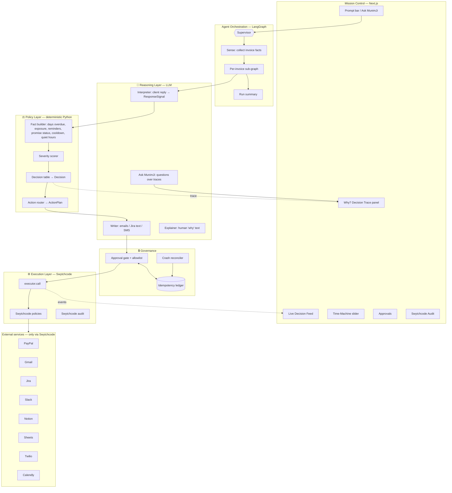

# 🪔 MunimJi — Implementation Plan (Single Source of Truth)

> **"Your AI munim who never sleeps, never forgets a payment, and knows exactly when to wait, when to nudge and when to call the boss."**
>
> An autonomous, governed **FinOps agent** that watches every payment, reads every client reply, decides what each situation deserves through a deterministic policy engine, and acts across PayPal, Gmail, Jira, Slack, Notion (+ Google Sheets, Twilio, Calendly) — all executed through **Swytchcode**.
>
> Build with Swytchcode Buildathon · **Track 6 — AI Business Operator Agent**
> GitHub: `gmayank9999` · Repo: `munimji`

---

## 0. How to use this document (Claude Code: read fully before writing code)

This is the **only** document needed to build MunimJi. It contains the product definition, architecture, every file, all schemas, the policy engine rules, prompts, seed data, UI spec, the 5 build phases (each with tasks, acceptance tests and a commit plan), the demo script and submission material. No outside context is required.

### 0.1 Non-negotiable rules
1. **Every external API call goes through Swytchcode** (`swytchcode_runtime.exec(...)` inside `backend/app/swy/executor.py`). No PayPal/Google/Slack/Notion/Jira/Twilio/Calendly SDKs or raw HTTP calls to those services anywhere in the agent. Swytchcode integration is 30% of the score.
2. **Canonical Swytchcode IDs live only in `backend/config/tool_registry.yaml`**, referenced in code by *logical name*. IDs in this document are **candidates**; verify each with `swy search` / `swy info <id>` and correct the YAML. Trust `swy info` over this document for field names too.
3. **The LLM never makes financial decisions.** The LLM *interprets* (reads emails, classifies client responses, extracts promise dates, writes messages, explains decisions). The **deterministic Policy Engine** (pure Python, unit tested) computes severity and decides the action. The **Action Router** maps decisions to tools by rule table. This split must be visible in code, UI and the architecture diagram ("Reasoning Layer" vs "Policy Layer" vs "Execution Layer").
4. **Every decision produces a Decision Trace** (inputs → computed facts → rule fired → actions → results) that is shown live in the UI and persisted to Notion + SQLite.
5. **Every step emits trace events** to the UI via SSE. If the judges can't see it, it didn't happen.
6. **Test/dummy data only**: PayPal **sandbox**, test Gmail, test Notion, test Slack, Jira free cloud site, Twilio trial, Calendly free, a test Google Sheet.
7. **Small commits, pushed often**, following Section 22 (Git workflow). Never one giant commit.

---

## 1. Product

### 1.1 The problem
Small businesses, agencies and freelancers in India live on receivables. Money gets stuck because:
- Nobody tracks every invoice daily. Payments go overdue silently.
- Follow-ups are manual, inconsistent and emotionally awkward: too soft for serious defaulters, too harsh for good clients who were just late.
- Signals are scattered: payment status in PayPal, client replies in Gmail ("will pay Friday", "the deliverable isn't done", "already paid!"), tasks in Jira, team chatter in Slack, records in Notion/Sheets.
- Escalation is either never or too late. The owner learns about a ₹85,000 hole two weeks after it happened.
- Traditional Indian businesses had a **munim** — the trusted accountant who knew every khata, every client's habit, and exactly when to send a reminder versus when to tell the seth. Modern small businesses don't have one.

### 1.2 The solution — MunimJi
An autonomous agent that, for every payment event:
1. **Senses** — pulls invoices, payments, refunds and disputes from PayPal; client context from Notion; the latest client email thread from Gmail.
2. **Interprets (LLM)** — classifies the client's reply (no response / acknowledged / promise-to-pay with date / dispute / claims already paid / extension request / hostile) and extracts facts.
3. **Decides (deterministic Policy Engine)** — computes days overdue, exposure, reminder count, client risk tier, promise status, cooldowns and quiet hours → a severity score and one decision: `CLOSE`, `WAIT`, `FOLLOWUP`, `HIGH_PRIORITY`, `ESCALATE`, `DISPUTE_ROUTE`, `RECONCILE`, `CRITICAL`.
4. **Acts (Action Router)** — invokes exactly the tools that decision needs (Gmail reminder with the right tone, Jira ticket with the right priority, Slack alert, Twilio SMS to the owner, Calendly meeting link to the client, Sheets ledger append, Notion ledger update). Sometimes the correct action is **nothing** — and MunimJi says so, with a reason.
5. **Explains** — a "Why did I do this?" Decision Trace for every invoice.
6. **Stays governed** — Swytchcode policies make dangerous actions impossible (write-offs, invoice cancellation, large refunds), approvals gate sensitive ones, and idempotency guarantees a client never gets the same reminder twice, even across crashes.

### 1.3 Signature moments (the "wow")
| Moment | Why judges remember it |
|---|---|
| **Same agent, three invoices, three different decisions** (₹8k pending 1 day → WAIT; ₹22k overdue 5 days → FOLLOWUP; ₹85k overdue 11 days + 2 ignored reminders → ESCALATE with SMS + meeting link) | Visible judgment, not a chain |
| **"Already paid" reconciliation** — client emails "we paid yesterday", MunimJi checks PayPal, finds nothing, opens a reconciliation ticket instead of sending another reminder | API output changes the next action |
| **Promise tracking** — "will pay by Friday" → WAIT until Friday; Saturday unpaid → BROKEN_PROMISE → escalation quoting their own promise | Memory + temporal reasoning |
| **Time-Machine slider** — drag the clock forward 7 days, rerun, watch decisions escalate deterministically | Proves the policy engine is real and explainable |
| **Closed loop** — payment arrives → Jira ticket auto-closed, Slack ✅, ledger updated, reminders stop | End-to-end autonomy |
| **Governance** — agent tries to refund ₹60,000 → blocked by Swytchcode policy; ₹4,000 refund → Slack approval; crash mid-send → no duplicate email | Swytchcode's core value shown live |
| **MunimJi Lens (Chrome extension)** — open Orion's email in Gmail and a native-looking MunimJi strip appears *inside Gmail*: "₹85,000 · 11 days overdue · ESCALATED · Why?" — same on the PayPal invoice page and the Jira ticket | The agent lives where the owner already works; no one else will have this |
| **Ask MunimJi** — "Why did you escalate Orion?" / "What's my total exposure?" / "Pause reminders for Bluepeak till Monday" | Interactive agent, judge can play |

### 1.4 Pitch lines
- Hook: *"Every Indian business once had a munim who knew every khata by heart. Today's small businesses have PayPal, Gmail, Jira and Slack — and nobody connecting them. So I built MunimJi."*
- Architecture: *"The LLM reads and writes. The policy engine decides. Swytchcode executes and governs. No hallucinated financial decisions."*
- Close: *"MunimJi knows when to wait, when to nudge, and when to call the boss."*

---

## 2. Judging criteria → how MunimJi scores

| Criterion | Weight | Evidence in MunimJi |
|---|---|---|
| Swytchcode API Integration | 30% | 5 track integrations (PayPal, Gmail, Slack, Jira, Notion) + 3 extras (Google Sheets, Twilio, Calendly), all through Swytchcode; outputs chained (PayPal status → Gmail interpretation → policy → Jira/Slack/Twilio/Calendly); Swytchcode policies (block + approval), idempotency, dry-run, audit surfaced in UI; zero provider SDKs |
| Technical Implementation | 25% | LangGraph agent with supervisor + per-invoice sub-graph, 3-layer architecture (Reasoning / Policy / Execution), SQLite checkpointing with crash recovery, idempotency ledger, deterministic policy engine with 40+ unit tests, typed Pydantic contracts, SSE event streaming, workers |
| Innovation & Originality | 20% | Judgment-first agent (WAIT is a decision), promise tracking, "already paid" reconciliation, Time-Machine what-if, tone-adaptive communication by client tier, Decision Trace explainability |
| Functionality | 10% | Full loop on sandbox data, closed loop on payment, replay mode backup |
| Real-World Impact | 10% | Every SMB/agency/freelancer with receivables; configurable policies per business; delayed payments are a well-known pain for Indian small businesses |
| UX & Presentation | 5% | Live Decision Feed, "Why?" panel, Time-Machine slider, judge can type requests, **MunimJi Lens extension injecting native UI into Gmail, PayPal and Jira** |

Participant-guide checklist: meaningful multi-step tasks ✅ · multiple Swytchcode APIs together ✅ · agent chooses tools per situation ✅ · API outputs influence next actions ✅ · realistic problem ✅ · works end-to-end ✅ · clear architecture ✅ · interactive prompt interface with visible reasoning, tool selection, API calls and final outcome ✅.

---

## 3. Integrations & their roles

| Integration | Track? | Role in MunimJi | Key operations |
|---|---|---|---|
| **PayPal** (sandbox) | ✅ | Source of truth for money: invoices, statuses, payments, refunds, disputes; send PayPal-native reminder | list/search invoices, get invoice, send invoice reminder, list disputes, get capture, refund capture (governed) |
| **Gmail** | ✅ | Read client threads (interpretation input); send tone-adapted follow-ups; include Calendly link | search, get message/thread, send, label |
| **Jira** | ✅ | Exception tickets with computed priority; one ticket per invoice (dedupe), updated on each decision; auto-transition to Done on payment | search (JQL), create issue, update issue (priority), add comment, transition |
| **Slack** | ✅ | Team alerts (#finance-ops), approvals (#munimji-approvals via ✅/❌ reactions), audit mirror, run digests, "Ask MunimJi" in Slack | post, update, history, reactions |
| **Notion** | ✅ | Business memory: Clients DB (tier, owner, notes, overrides), Invoices ledger (reminder count, last contact, promise date, state), Decision Trace DB, Run Reports | query, create page, update page, append blocks |
| **Google Sheets** | extra | Accountant-friendly exportable ledger: every decision + every payment appended | values append, values get |
| **Twilio** | extra | Owner escalation SMS (quiet-hours aware); optional voice call | messages create (calls create optional) |
| **Calendly** | extra | For high-value stuck accounts: single-use scheduling link embedded in the email instead of another reminder | get current user, list event types, create scheduling link |

> Extras sit behind feature flags (`FEATURE_SHEETS`, `FEATURE_TWILIO`, `FEATURE_CALENDLY`). With all flags off, the product is still complete with the 5 track integrations. With flags on, the agent has 8 capabilities and chooses among them.

---
## 4. Architecture

### 4.1 Three-layer design (show exactly these boxes in the diagram)



### 4.2 Per-invoice decision pipeline (the core loop)
```
Invoice (PayPal) ─┐
Client (Notion)  ─┼─► Fact Builder ─► Interpreter (LLM, only if new client mail) ─► ResponseSignal
Thread (Gmail)   ─┘                                                                   │
                                                                                      ▼
                        Policy Engine: facts + signal → severity (0-100) → Decision + rule_id
                                                                                      │
                                                        Action Router (rule table) → ActionPlan[]
                                                                                      │
                            Writer (LLM) fills message text for Gmail/Jira/Slack/SMS  │
                                                                                      ▼
                     Governance Gate: allowlist → idempotency → approval (if required)
                                                                                      │
                                                         Swytchcode Executor → services
                                                                                      │
                                   Decision Trace → SQLite + Notion + Sheets + UI feed
```

### 4.3 Request lifecycle — "Check all pending PayPal transactions and take necessary action"
1. UI `POST /api/run` → `run_id`; SSE stream opens.
2. Supervisor (LLM, structured) → intent `sweep` with scope `all_open`.
3. `sense` node: PayPal list invoices (all non-terminal statuses) + list disputes; Notion clients + ledger; build `InvoiceContext` list.
4. `Send` fan-out → per-invoice sub-graph (concurrency 3, ordered by exposure desc so the dramatic ones appear first in DEMO_MODE… or ascending to build the story — configurable `FEED_ORDER=story`).
5. Each sub-graph: fetch Gmail thread → interpret (if unseen messages) → policy → router → writer → gate → execute → trace.
6. Summary node → Slack digest, Notion Run Report, Sheets row, UI final card: "18 invoices scanned · 5 closed · 4 waiting · 4 reminders · 2 high-priority · 1 escalated · 1 reconciliation · 1 dispute routed · ₹3.2L exposure · 71 Swytchcode calls".

---

## 5. Tech stack

| Layer | Choice |
|---|---|
| Backend language | Python 3.11 |
| Agent framework | `langgraph` + `langgraph-checkpoint-sqlite` |
| LLM | Anthropic via `langchain-anthropic`: `claude-sonnet-5` (writer, explainer, Q&A), `claude-haiku-4-5-20251001` (interpreter, supervisor) |
| Execution | Swytchcode CLI (`swy`) + `swytchcode-runtime` (Python) |
| API | FastAPI + Uvicorn + `sse-starlette` |
| Jobs | APScheduler (AsyncIOScheduler) |
| Storage | SQLite via `aiosqlite` (app DB) + separate SQLite for LangGraph checkpoints |
| Validation | Pydantic v2, `pydantic-settings` |
| Dates | `python-dateutil`, `zoneinfo` (Asia/Kolkata) |
| Tests | `pytest`, `pytest-asyncio`, `hypothesis` (property tests for the policy engine) |
| Lint/format | `ruff` |
| Frontend | Next.js 14 (App Router, TypeScript), Tailwind, shadcn/ui, `@xyflow/react` (agent graph), `framer-motion`, `recharts`, `lucide-react` |

`backend/requirements.txt`
```
fastapi
uvicorn[standard]
sse-starlette
langgraph
langgraph-checkpoint-sqlite
langchain-anthropic
langchain-core
anthropic
swytchcode-runtime
pydantic>=2
pydantic-settings
pyyaml
aiosqlite
apscheduler
python-dateutil
rich
httpx
```
`backend/requirements-dev.txt`
```
pytest
pytest-asyncio
hypothesis
ruff
```
(Deliberately **no** provider SDKs.)

---

## 6. Repository structure

```
munimji/
├── README.md
├── IMPLEMENTATION_PLAN.md
├── CLAUDE.md
├── LICENSE                         (MIT)
├── .gitignore
├── .env.example
├── Makefile
├── docs/
│   ├── architecture.mmd
│   ├── architecture.png
│   ├── decision-table.md           (generated from policy config, Section 11.6)
│   ├── demo-script.md
│   └── screenshots/
├── .swytchcode/                    (from `swy init`; commit tooling/policy files, never credentials)
├── backend/
│   ├── app/
│   │   ├── main.py                 FastAPI app + lifespan (workers, reconciler)
│   │   ├── settings.py
│   │   ├── clock.py                Time-Machine aware clock (Section 11.7)
│   │   ├── db.py                   SQLite schema + repositories
│   │   ├── events.py               trace bus + persistence + SSE fan-out
│   │   ├── money.py                Money type, INR normalisation, formatting (₹1,23,456)
│   │   ├── swy/
│   │   │   ├── registry.py
│   │   │   ├── executor.py         THE only caller of swytchcode_runtime.exec
│   │   │   ├── errors.py
│   │   │   └── audit.py
│   │   ├── integrations/           typed helpers over executor
│   │   │   ├── paypal.py
│   │   │   ├── gmail.py
│   │   │   ├── jira.py
│   │   │   ├── slack.py
│   │   │   ├── notion.py
│   │   │   ├── sheets.py
│   │   │   ├── twilio.py
│   │   │   └── calendly.py
│   │   ├── reasoning/              LLM layer
│   │   │   ├── llm.py
│   │   │   ├── prompts.py
│   │   │   ├── interpreter.py
│   │   │   ├── writer.py
│   │   │   ├── explainer.py
│   │   │   └── ask.py
│   │   ├── policy/                 deterministic layer
│   │   │   ├── config.py           loads config/policy.yaml
│   │   │   ├── facts.py
│   │   │   ├── severity.py
│   │   │   ├── rules.py            decision table
│   │   │   ├── router.py           decision → ActionPlan
│   │   │   └── explain.py          deterministic reason bullets
│   │   ├── governance/
│   │   │   ├── gate.py
│   │   │   ├── ledger.py
│   │   │   ├── reconcile.py
│   │   │   └── allowlist.py
│   │   ├── agent/
│   │   │   ├── state.py
│   │   │   ├── schemas.py
│   │   │   ├── supervisor.py
│   │   │   ├── sense.py
│   │   │   ├── invoice_graph.py    per-invoice sub-graph
│   │   │   ├── executor_node.py
│   │   │   ├── summary.py
│   │   │   ├── ask_node.py
│   │   │   ├── override_node.py
│   │   │   └── graph.py
│   │   ├── workers/
│   │   │   ├── sweeper.py          scheduled sweeps
│   │   │   ├── slack_poller.py     approvals + "munimji:" prompts
│   │   │   ├── paypal_watcher.py   detects payments → closed loop
│   │   │   └── deferred_queue.py   quiet-hours SMS queue
│   │   └── replay.py
│   ├── config/
│   │   ├── business.yaml           the business using MunimJi
│   │   ├── policy.yaml             thresholds, weights, cooldowns, quiet hours
│   │   ├── tool_registry.yaml
│   │   ├── allowlist.yaml
│   │   └── workspace_ids.yaml      written by setup scripts (Notion DB ids, Jira project, Slack channel ids, Sheet id, Calendly event type)
│   ├── scripts/
│   │   ├── smoke_swytchcode.py
│   │   ├── setup_notion.py
│   │   ├── setup_jira.py
│   │   ├── setup_slack.py
│   │   ├── setup_sheets.py
│   │   ├── setup_calendly.py
│   │   ├── seed_paypal.py
│   │   ├── seed_gmail.py
│   │   ├── seed_notion.py
│   │   ├── demo_reset.py
│   │   ├── simulate_payment.py     pays a sandbox invoice (closed-loop demo)
│   │   └── run_forever.sh          auto-restart backend (crash demo)
│   ├── seed/
│   │   ├── clients.yaml
│   │   ├── invoices.yaml
│   │   └── threads/                client email threads (.txt with headers)
│   └── tests/
│       ├── policy/                 test_facts.py, test_severity.py, test_rules.py, test_router.py, test_properties.py
│       ├── governance/             test_ledger.py, test_gate.py, test_allowlist.py
│       ├── reasoning/              test_interpreter_eval.py (golden set)
│       ├── test_money.py
│       ├── test_clock.py
│       └── test_executor_dryrun.py
├── extension/                     MunimJi Lens — Chrome MV3 extension (Section 17B)
│   ├── manifest.config.ts
│   ├── vite.config.ts
│   ├── src/
│   │   ├── background/service-worker.ts   the ONLY place that talks to the backend
│   │   ├── content/gmail.tsx
│   │   ├── content/gmail-compose.tsx
│   │   ├── content/paypal.tsx
│   │   ├── content/jira.tsx
│   │   ├── content/mount.ts               shadow-DOM mounting + MutationObserver helpers
│   │   ├── ui/ (LensStrip, DecisionPill, WhyPopover, ActionButton, ApprovalMini, ThemeBridge)
│   │   ├── popup/ (Popup.tsx: KPIs + pending approvals)
│   │   ├── options/ (Options.tsx: backend URL + extension key)
│   │   └── lib/ (api.ts, selectors.ts, parse.ts, format.ts)
│   ├── public/icons/ (16, 32, 48, 128 px diya icons)
│   └── package.json
└── frontend/
    ├── app/ (page.tsx, invoices/page.tsx, clients/page.tsx, audit/page.tsx, policy/page.tsx, layout.tsx)
    ├── components/ (PromptBar, DecisionFeed, DecisionCard, WhyPanel, TimeMachine, AgentGraph, KpiStrip,
    │               ApprovalDrawer, PolicyBlockedCard, RecoveryCard, ToolCallChip, RunSummaryCard, AskPanel, ChaosToggle)
    ├── lib/ (api.ts, sse.ts, format.ts)
    └── package.json
```

---

## 7. Accounts & workspace setup

| Service | What to create | Notes |
|---|---|---|
| Swytchcode | account (done), CLI login | `swy login` |
| PayPal Developer | sandbox **business** account (MunimJi's business: "Kaarigar Studio") + 6–8 sandbox **personal** accounts (clients) | Sandbox only; the business account's app credentials are what Swytchcode connects to |
| Gmail | business inbox `kaarigar.studio.demo@gmail.com`; one "clients" inbox `kaarigar.clients.sim@gmail.com` whose plus-addresses act as clients (`kaarigar.clients.sim+orion@gmail.com`) | Plus-addressing lets one real inbox receive all "client" emails — real delivery, zero risk |
| Jira Cloud (free) | site + project key **FIN** ("Finance Exceptions"), issue type Task, priorities Highest/High/Medium/Low/Lowest, labels used: `munimji`, `inv-<number>` | API token for Swytchcode auth |
| Slack | workspace "Kaarigar Studio (Demo)" + bot; channels `#finance-ops`, `#munimji-approvals`, `#munimji-audit`, `#munimji` (Ask MunimJi) | bot scopes: chat:write, channels:history, channels:read, reactions:read, reactions:write, users:read |
| Notion | workspace + parent page "MunimJi HQ" shared with the integration | DBs created by script |
| Google Sheets | spreadsheet "MunimJi Ledger" with tabs `Payments`, `Decisions`, `Runs` | created/validated by script |
| Twilio | trial account, verified owner phone number, trial sender number | trial can only SMS verified numbers — that is fine: the owner is you |
| Calendly | free account, one event type "Payment discussion — 20 min" | used to generate single-use scheduling links |
| Anthropic | API key | |

### 7.1 `.env.example`
```
ANTHROPIC_API_KEY=
MODEL_REASONING=claude-sonnet-5
MODEL_FAST=claude-haiku-4-5-20251001

SWYTCHCODE_TOKEN=            # only for headless runs; otherwise `swy login` session
SWYTCHCODE_BIN=

BUSINESS_EMAIL=kaarigar.studio.demo@gmail.com
OWNER_PHONE_E164=+91XXXXXXXXXX
TWILIO_FROM_E164=+1XXXXXXXXXX
SLACK_APPROVER_USER_ID=
TIMEZONE=Asia/Kolkata

APP_DB_PATH=./data/munimji.db
CHECKPOINT_DB_PATH=./data/checkpoints.db

FEATURE_SHEETS=true
FEATURE_TWILIO=true
FEATURE_CALENDLY=true
FEATURE_PAYPAL_NATIVE_REMINDER=true

DEMO_MODE=true
DEMO_EPOCH=1                  # bumped by demo_reset; part of every idempotency key
FEED_ORDER=story              # story | exposure_desc | due_asc
REPLAY_MODE=off               # off | record | replay
CLOCK_OFFSET_DAYS=0           # Time-Machine default
EXTENSION_KEY=change-me-long-random   # shared secret for MunimJi Lens
EXTENSION_ID=                 # set after loading the unpacked extension (for CORS)
```

---

## 8. Swytchcode setup

### 8.1 Install, login, init
```bash
curl -fsSL https://cli.swytchcode.com/install.sh | sh     # or: npm install -g swytchcode
swy --version
swy login
cd munimji
swy init
swy init --editor=claude       # optional: gives Claude Code the Swytchcode MCP while building
```

### 8.2 Pull integrations (use exact slugs printed by `swy search`)
```bash
for i in paypal gmail jira slack notion google-sheets twilio calendly; do swy search $i; done
swy get paypal
swy get gmail
swy get jira
swy get slack
swy get notion
swy get google-sheets
swy get twilio
swy get calendly
```

### 8.3 Methods to enable (candidates — verify with `swy info`, then `swy add method <id>`)

| Logical name | Purpose | Candidate canonical ID | Underlying API | Risk |
|---|---|---|---|---|
| `paypal.invoices.list` | all invoices | `paypal.invoicing.invoices.list` | GET /v2/invoicing/invoices | read |
| `paypal.invoices.search` | filter by status/date | `paypal.invoicing.search-invoices` | POST /v2/invoicing/search-invoices | read |
| `paypal.invoices.get` | detail incl. payments, due date | `paypal.invoicing.invoices.get` | GET /v2/invoicing/invoices/{id} | read |
| `paypal.invoices.create` | seeding only | `paypal.invoicing.invoices.create` | POST /v2/invoicing/invoices | write (setup) |
| `paypal.invoices.send` | seeding only | `paypal.invoicing.invoices.send` | POST …/{id}/send | send (setup) |
| `paypal.invoices.remind` | PayPal-native reminder | `paypal.invoicing.invoices.remind` | POST …/{id}/remind | send |
| `paypal.invoices.record_payment` | simulate payment (demo script) | `paypal.invoicing.invoices.payments` | POST …/{id}/payments | write (setup/demo) |
| `paypal.invoices.cancel` | **must be blocked** | `paypal.invoicing.invoices.cancel` | POST …/{id}/cancel | blocked |
| `paypal.disputes.list` | disputes / refund requests | `paypal.customer.disputes.list` | GET /v1/customer/disputes | read |
| `paypal.captures.refund` | refunds (governed) | `paypal.payments.captures.refund` | POST /v2/payments/captures/{id}/refund | send |
| `gmail.search` | threads per client | `gmail.users.messages.list` | | read |
| `gmail.thread.get` | full thread | `gmail.users.threads.get` | | read |
| `gmail.get` | message | `gmail.users.messages.get` | | read |
| `gmail.send` | follow-ups | `gmail.users.messages.send` | | send |
| `gmail.insert` | seeding | `gmail.users.messages.insert` | | write (setup) |
| `gmail.labels.list` / `.create` / `gmail.modify` | label `munimji-seen` | `gmail.users.labels.*`, `gmail.users.messages.modify` | | write |
| `jira.search` | dedupe by label | `jira.search` (JQL) | GET /rest/api/3/search | read |
| `jira.issue.create` | exception ticket | `jira.issue.create` | POST /rest/api/3/issue | write |
| `jira.issue.update` | change priority | `jira.issue.edit` | PUT /rest/api/3/issue/{key} | write |
| `jira.issue.comment` | decision log on ticket | `jira.issue.comment.add` | POST …/comment | write |
| `jira.issue.transitions` / `jira.issue.transition` | close on payment | `jira.issue.transitions.get` / `jira.issue.transitions.do` | | write |
| `slack.post` / `slack.update` / `slack.history` / `slack.reactions.get` / `slack.reactions.add` / `slack.channels.list` | alerts, approvals, polling | `slack.chat.postMessage`, `slack.chat.update`, `slack.conversations.history`, `slack.reactions.get`, `slack.reactions.add`, `slack.conversations.list` | | write/read |
| `notion.db.create` / `notion.db.query` / `notion.page.create` / `notion.page.update` / `notion.blocks.append` / `notion.search` | memory + traces | `notion.databases.create`, `notion.databases.query`, `notion.pages.create`, `notion.pages.update`, `notion.blocks.children.append`, `notion.search` | | write/read |
| `sheets.append` / `sheets.get` | ledger | `google-sheets.spreadsheets.values.append`, `google-sheets.spreadsheets.values.get` | | write/read |
| `twilio.sms.send` | owner escalation | `twilio.messages.create` | | send |
| `calendly.me` / `calendly.event_types` / `calendly.scheduling_link` | meeting link | `calendly.users.me`, `calendly.event_types.list`, `calendly.scheduling_links.create` | | read/write |

### 8.4 Credentials
```bash
swy auth connect paypal        # sandbox app client id/secret
swy auth connect gmail
swy auth connect jira          # site URL + email + API token
swy auth connect slack
swy auth connect notion
swy auth connect google-sheets
swy auth connect twilio
swy auth connect calendly
```
Credentials stay in Swytchcode's local store (`~/.swytchcode/`) and are never visible to the model or committed. If a connector expects a different auth flow, follow the Swytchcode docs → *Managed Authentication*.

### 8.5 `backend/config/tool_registry.yaml`
```yaml
# logical: { id: <verified canonical id>, risk: read|write|send|blocked, setup_only: bool }
paypal.invoices.list:      { id: "paypal.invoicing.invoices.list", risk: read }
paypal.invoices.search:    { id: "paypal.invoicing.search-invoices", risk: read }
paypal.invoices.get:       { id: "paypal.invoicing.invoices.get", risk: read }
paypal.invoices.create:    { id: "paypal.invoicing.invoices.create", risk: write, setup_only: true }
paypal.invoices.send:      { id: "paypal.invoicing.invoices.send", risk: send, setup_only: true }
paypal.invoices.remind:    { id: "paypal.invoicing.invoices.remind", risk: send }
paypal.invoices.record_payment: { id: "paypal.invoicing.invoices.payments", risk: write, setup_only: true }
paypal.invoices.cancel:    { id: "paypal.invoicing.invoices.cancel", risk: blocked }
paypal.disputes.list:      { id: "paypal.customer.disputes.list", risk: read }
paypal.captures.refund:    { id: "paypal.payments.captures.refund", risk: send }
gmail.search:              { id: "gmail.users.messages.list", risk: read }
gmail.thread.get:          { id: "gmail.users.threads.get", risk: read }
gmail.get:                 { id: "gmail.users.messages.get", risk: read }
gmail.send:                { id: "gmail.users.messages.send", risk: send }
gmail.insert:              { id: "gmail.users.messages.insert", risk: write, setup_only: true }
gmail.labels.list:         { id: "gmail.users.labels.list", risk: read }
gmail.labels.create:       { id: "gmail.users.labels.create", risk: write }
gmail.modify:              { id: "gmail.users.messages.modify", risk: write }
jira.search:               { id: "jira.search", risk: read }
jira.issue.create:         { id: "jira.issue.create", risk: write }
jira.issue.update:         { id: "jira.issue.edit", risk: write }
jira.issue.comment:        { id: "jira.issue.comment.add", risk: write }
jira.issue.transitions:    { id: "jira.issue.transitions.get", risk: read }
jira.issue.transition:     { id: "jira.issue.transitions.do", risk: write }
slack.post:                { id: "slack.chat.postMessage", risk: write }
slack.update:              { id: "slack.chat.update", risk: write }
slack.history:             { id: "slack.conversations.history", risk: read }
slack.reactions.get:       { id: "slack.reactions.get", risk: read }
slack.reactions.add:       { id: "slack.reactions.add", risk: write }
slack.channels.list:       { id: "slack.conversations.list", risk: read }
notion.db.create:          { id: "notion.databases.create", risk: write, setup_only: true }
notion.db.query:           { id: "notion.databases.query", risk: read }
notion.page.create:        { id: "notion.pages.create", risk: write }
notion.page.update:        { id: "notion.pages.update", risk: write }
notion.blocks.append:      { id: "notion.blocks.children.append", risk: write }
notion.search:             { id: "notion.search", risk: read }
sheets.append:             { id: "google-sheets.spreadsheets.values.append", risk: write }
sheets.get:                { id: "google-sheets.spreadsheets.values.get", risk: read }
twilio.sms.send:           { id: "twilio.messages.create", risk: send }
calendly.me:               { id: "calendly.users.me", risk: read }
calendly.event_types:      { id: "calendly.event_types.list", risk: read }
calendly.scheduling_link:  { id: "calendly.scheduling_links.create", risk: write }
```
`risk: send` = reaches a human (client or owner) or moves money → always passes the Governance Gate. `risk: blocked` = the registry refuses to resolve it for agent code (and Swytchcode policy blocks it too — defence in depth).

### 8.6 Swytchcode policies
Add with `swy policy add`, validate with `swy policy validate`, inspect with `swy audit policy`. Documented rule shape:
```json
{ "id": "...", "target": ["<canonical id>"], "when": { "field": "...", "operator": "...", "value": ... },
  "action": { "type": "POLICY_BLOCKED", "message": "..." } }
```
MunimJi policy set (adapt field paths/operators and the approval action type to what `swy policy validate` accepts; see docs → *Policy Rules*, *Human approval*, *Production Guardrails*):

| Policy id | Target | Condition | Action |
|---|---|---|---|
| `block-invoice-cancel` | paypal invoice cancel | always (`id` exists) | POLICY_BLOCKED "Cancelling invoices (write-offs) must be done by the owner." |
| `block-large-refund` | paypal capture refund | `amount.value` > 10000 (INR) or > 120 (USD sandbox) | POLICY_BLOCKED "Refunds above ₹10,000 are owner-only." |
| `approve-refund` | paypal capture refund | `amount.value` exists | require approval (native type if supported) |
| `block-gmail-delete` | gmail delete/trash | always | POLICY_BLOCKED |
| `block-jira-delete` | jira issue delete | always | POLICY_BLOCKED |
| `approve-sms` | twilio messages create | always | require approval **only if** Swytchcode native approval is non-blocking for demo; otherwise skip (owner SMS is internal) |
| `sms-to-owner-only` | twilio messages create | `To` != owner number | POLICY_BLOCKED "MunimJi may only text the business owner." |

**Two-layer governance (works whatever Swytchcode's approval semantics turn out to be):**
- Layer 1 — Swytchcode: hard blocks (cancel, large refund, deletes, SMS to non-owner). In Phase 1, run a blocked call by hand and record the exact error shape so `executor.py` can classify it as `POLICY_BLOCKED`. Also test the approval rule and record behaviour (pending id? exit code? dashboard approval?). If native approval works, surface it in UI + Slack.
- Layer 2 — MunimJi Governance Gate: Slack ✅/❌ approvals, recipient allowlist, idempotency ledger, cooldowns. Always active.
- Check docs → *Idempotency* for a native idempotency option on exec; if available pass MunimJi's `idem_key` through it too.

### 8.7 Smoke test (`scripts/smoke_swytchcode.py`)
One read per integration + one dry-run write: PayPal invoices list · Gmail labels list · Jira search `project = FIN` · Slack channels list · Notion search · Sheets get A1 · Calendly me · Twilio dry-run SMS. Prints a green/red table with latency. Also attempts `paypal.invoices.cancel` in dry-run to confirm POLICY_BLOCKED.

---

## 9. Swytchcode executor & integration helpers

### 9.1 `swy/executor.py`
```python
class ToolCallResult(BaseModel):
    logical: str; canonical_id: str
    ok: bool; data: Any | None = None; error: str | None = None
    duration_ms: int
    policy_blocked: bool = False; policy_id: str | None = None
    approval_required: bool = False
    dry_run: bool = False

async def call(logical: str, args: dict, *, ctx: CallCtx, dry_run: bool = False,
               idem_key: str | None = None) -> ToolCallResult:
    """
    ctx = {run_id, invoice_id|None, node}
    1. entry = registry.resolve(logical)  -> raises if unknown, if risk == 'blocked' raises PolicyBlockedLocal
       (EXCEPT when ctx.node == 'governance_demo', which deliberately forwards to Swytchcode to show its block)
    2. emit('tool_call.started', ...) with redacted args (truncate strings > 300 chars, drop 'raw', mask phone digits)
    3. result = await asyncio.to_thread(swytchcode_runtime.exec, entry.id, args, dry_run=dry_run, ...)
       under a global Semaphore(4) and per-integration semaphores (notion 3, jira 3, others 4)
    4. classify errors: POLICY_BLOCKED (from Phase-1 recorded shape) / approval pending / generic failure
    5. emit('tool_call.finished' | 'policy.blocked', ...), insert into tool_calls table
    6. mirror one line to Slack #munimji-audit for write/send (fire-and-forget; skip for audit posts)
    7. DEMO_MODE: sleep 120 ms so the feed animation is readable
    """
```
No HTTP retries here — retries, auth and validation are Swytchcode's job. Retry once only if the CLI process failed to spawn.

### 9.2 Integration helpers (typed; agents never build raw payloads)

**paypal.py**
- `list_open_invoices() -> list[PaypalInvoice]` — paginate; keep statuses `SENT, UNPAID, PARTIALLY_PAID, PAYMENT_PENDING, SCHEDULED` plus recently `PAID/MARKED_AS_PAID/REFUNDED/PARTIALLY_REFUNDED` (last 14 days, for closing loops).
- `get_invoice(id) -> PaypalInvoice` — parse `detail.invoice_number`, `detail.invoice_date`, `detail.payment_term.due_date`, `amount.value`, `amount.currency_code`, `due_amount`, `payments.transactions[]` (amount, date, method), `primary_recipients[0].billing_info.email_address`, `status`.
- `list_disputes(since) -> list[PaypalDispute]` (id, reason e.g. `MERCHANDISE_OR_SERVICE_NOT_AS_DESCRIBED`, status, amount, linked transaction/invoice).
- `send_native_reminder(invoice_id, subject, note)` — governed send.
- `refund_capture(capture_id, amount)` — governed send; used only after approval.

`PaypalInvoice` model: `id, number, status, client_email, amount: Money, due_amount: Money, paid_amount: Money, invoice_date, due_date, last_payment_date, payments: list[Payment]`.

**gmail.py** — `thread_for_client(client_email, invoice_number) -> list[GmailMessage]` (query: `(from:{email} OR to:{email}) newer_than:60d` and prefer threads containing the invoice number), `unseen_client_messages(thread, seen_ids)`, `build_raw(...)` (sets `Message-ID: <munimji-{idem_key}@kaarigar.studio>`, `In-Reply-To/References` to keep threading, `X-MunimJi-Decision`, `X-MunimJi-Key`), `send(raw, thread_id)`, `find_sent(message_id_header) -> bool` (search `rfc822msgid:`), `ensure_label`, `add_label`.

**jira.py** — `find_ticket(invoice_number) -> issue|None` (JQL `project = FIN AND labels = "inv-{n}" AND statusCategory != Done`), `create_ticket(summary, description_adf, priority, labels)`, `set_priority(key, p)`, `comment(key, adf)`, `close(key)` (find transition named Done/Resolved). Provide `to_adf(markdown)` for Atlassian Document Format (paragraphs, bullet lists, bold, code).

**slack.py** — `post`, `update`, `history`, `reactions`, `add_reaction`, `channel_id` (cached). Block Kit builders: `decision_block(trace)`, `approval_block(action)`, `digest_blocks(summary)`.

**notion.py** — `query_all(db, filter)`, `upsert_invoice_row(ctx)`, `append_trace(trace)`, `create_run_report(summary)`, `get_clients()`, `get_overrides()`, `md_to_blocks()` (chunk 2,000-char rich text, ≤100 blocks per append).

**sheets.py** — `append_rows(tab, rows)`; batches rows per run (one append per tab per run to respect quotas).

**twilio.py** — `sms_owner(text)`; hard-coded to `OWNER_PHONE_E164` (and policy-enforced).

**calendly.py** — `scheduling_link() -> url` using cached event type URI (from `setup_calendly.py`), `max_event_count=1` single-use.

---
## 10. Data model

### 10.1 SQLite app DB (`db.py`)
```sql
CREATE TABLE runs (run_id TEXT PRIMARY KEY, prompt TEXT, source TEXT, intent TEXT, clock_offset_days INTEGER,
                   status TEXT, started_at TEXT, finished_at TEXT, summary_json TEXT);
CREATE TABLE trace_events (id INTEGER PRIMARY KEY AUTOINCREMENT, run_id TEXT, seq INTEGER, ts TEXT,
                   type TEXT, node TEXT, invoice_id TEXT, payload_json TEXT);
CREATE TABLE tool_calls (id INTEGER PRIMARY KEY AUTOINCREMENT, run_id TEXT, invoice_id TEXT, node TEXT,
                   logical TEXT, canonical_id TEXT, ok INTEGER, policy_blocked INTEGER, duration_ms INTEGER, ts TEXT);
CREATE TABLE invoices (invoice_id TEXT PRIMARY KEY, number TEXT, client_id TEXT, status TEXT,
                   amount_inr INTEGER, due_inr INTEGER, invoice_date TEXT, due_date TEXT,
                   reminder_count INTEGER DEFAULT 0, last_reminder_at TEXT, last_client_msg_at TEXT,
                   promise_date TEXT, promise_source_msg TEXT, dispute_open INTEGER DEFAULT 0,
                   jira_key TEXT, notion_page_id TEXT, state TEXT, last_decision TEXT, last_severity INTEGER,
                   updated_at TEXT);
CREATE TABLE clients (client_id TEXT PRIMARY KEY, name TEXT, email TEXT, tier TEXT, contact_name TEXT,
                   relationship_notes TEXT, notion_page_id TEXT, paused_until TEXT);
CREATE TABLE interpretations (message_id TEXT PRIMARY KEY, invoice_id TEXT, signal_json TEXT, created_at TEXT);
CREATE TABLE decisions (id INTEGER PRIMARY KEY AUTOINCREMENT, run_id TEXT, invoice_id TEXT, as_of TEXT,
                   facts_json TEXT, signal_json TEXT, severity INTEGER, severity_breakdown_json TEXT,
                   decision TEXT, rule_id TEXT, reasons_json TEXT, plan_json TEXT, results_json TEXT,
                   explanation TEXT, created_at TEXT);
CREATE TABLE action_ledger (idem_key TEXT PRIMARY KEY, run_id TEXT, thread_id TEXT, invoice_id TEXT,
                   action_type TEXT, tool TEXT, payload_json TEXT,
                   status TEXT CHECK(status IN ('planned','pending_approval','approved','executing','done',
                                                'rejected','failed','blocked','skipped','deferred')),
                   approval_channel TEXT, approval_ts TEXT, result_json TEXT, created_at TEXT, updated_at TEXT);
CREATE TABLE deferred_actions (idem_key TEXT PRIMARY KEY, due_at TEXT, reason TEXT);
CREATE TABLE cursors (name TEXT PRIMARY KEY, value TEXT);
CREATE TABLE llm_cache (key TEXT PRIMARY KEY, output_json TEXT, created_at TEXT);
```
LangGraph checkpoints: separate `checkpoints.db` via `AsyncSqliteSaver`.

### 10.2 Notion databases (created by `setup_notion.py` under "MunimJi HQ")
**Clients** — Name (title), Client ID, Email, Tier (select: VIP, Regular, New, Watchlist), Contact Person, Relationship Notes, Paused Until (date), Payment Behaviour (select: Prompt, Usually Late, Chronic), Lifetime Billed (₹, number), Open Exposure (₹, number, updated by agent).
**Invoices Ledger** — Invoice # (title), PayPal ID, Client (relation → Clients), Amount (₹), Due Amount (₹), Due Date, Status (select mirroring PayPal), MunimJi State (select: Healthy, Watching, Reminded, High Priority, Escalated, Disputed, Reconciling, Promise Pending, Promise Broken, Closed), Days Overdue (number), Reminder Count, Last Reminder, Promise Date, Jira (url), Last Decision (select), Severity (number), Last Reasoning (rich text).
**Decision Traces** — Title ("INV-1077 · ESCALATE · 11 Oct"), Invoice (relation), Run ID, As Of, Decision, Rule ID, Severity, Facts (rich text JSON-ish bullets), Client Signal, Reasons, Actions Taken, Result, Explanation.
**Run Reports** — Title, Run ID, Prompt, Started, Invoices Scanned, Counts per decision, Exposure (₹), Swytchcode Calls, Policy Blocks, Approvals.
`setup_notion.py` writes DB IDs to `config/workspace_ids.yaml`.

### 10.3 Google Sheet "MunimJi Ledger"
- `Payments`: timestamp, invoice #, client, amount ₹, method, PayPal txn id, detected_by_run
- `Decisions`: timestamp, run id, as_of, invoice #, client, due ₹, days overdue, severity, decision, rule, actions, result
- `Runs`: run id, started, prompt, scanned, closed, waiting, followups, high, escalated, disputes, reconciliations, exposure ₹, swytchcode calls

### 10.4 `config/business.yaml`
```yaml
business_name: "Kaarigar Studio"
business_type: "Design & development agency, Gurugram"
owner_name: "Mayank"
owner_title: "Founder"
sender_name: "Accounts · Kaarigar Studio"
signature: |
  Warm regards,
  Accounts Team · Kaarigar Studio
  Gurugram
tone_guide: "Warm, respectful, Indian business English. Never threatening. Firmness comes from clarity, not aggression."
currency_display: INR
paypal_currency: USD            # set to INR if the sandbox accepts INR invoices; money.py converts
fx_inr_per_usd: 83.0            # fixed demo rate, shown in README
payment_link_note: "You can pay directly via the PayPal invoice link."
```

### 10.5 `config/policy.yaml` (all thresholds live here — never in code)
```yaml
grace_days: 2                        # overdue ≤ 2 days treated as not yet actionable
followup_after_days: 3
high_priority_after_days: 7
escalate_amount_inr: 50000
critical_amount_inr: 150000
min_reminders_before_escalation: 2
reminder_cooldown_hours: 72
promise_grace_days: 1                # wait until promise_date + 1 day
max_reminders_before_human: 4        # after this, MunimJi stops emailing and hands over to owner
quiet_hours: { start: "21:00", end: "09:00" }   # no SMS in this window → deferred
business_days_only_for_email: true   # emails on Sat/Sun deferred to Monday 10:00 (disable in DEMO_MODE)
tier_multipliers: { VIP: 0.8, Regular: 1.0, New: 1.1, Watchlist: 1.3 }
severity_weights:
  aging: 35
  exposure: 25
  reminders_ignored: 15
  client_signal: 15
  tier: 10
severity_bands:                      # used for display and Jira priority mapping
  - { min: 0,  max: 19, label: "Low",      jira: "Low" }
  - { min: 20, max: 44, label: "Moderate", jira: "Medium" }
  - { min: 45, max: 69, label: "High",     jira: "High" }
  - { min: 70, max: 100, label: "Critical", jira: "Highest" }
refund_auto_propose_max_inr: 10000   # above this → Swytchcode blocks; owner only
```

---

## 11. Policy Layer (deterministic heart of MunimJi)

### 11.1 Inputs
```python
class InvoiceFacts(BaseModel):
    invoice_id: str; number: str; client_id: str; client_name: str; client_tier: Literal["VIP","Regular","New","Watchlist"]
    paypal_status: str                     # raw
    amount_inr: int; due_inr: int; paid_inr: int
    invoice_date: date; due_date: date; as_of: datetime
    days_overdue: int                      # max(0, (as_of.date() - due_date).days)
    days_since_issue: int
    is_partially_paid: bool
    reminder_count: int                    # MunimJi + seeded prior reminders
    hours_since_last_reminder: float | None
    last_client_msg_at: datetime | None
    unanswered_reminders: int              # reminders sent after the last client message
    promise_date: date | None
    promise_status: Literal["none","pending","broken","kept"]
    dispute_open: bool                     # PayPal dispute or client-signal dispute
    refund_requested_inr: int | None
    paused_until: date | None              # owner override
    in_quiet_hours: bool
    is_business_day: bool
    open_jira_key: str | None
    client_open_exposure_inr: int          # sum of due across the client's open invoices

class ResponseSignal(BaseModel):          # from the Reasoning Layer (LLM)
    category: Literal["NO_RESPONSE","ACKNOWLEDGED","PROMISE_TO_PAY","DISPUTE","CLAIMS_PAID",
                      "EXTENSION_REQUEST","REFUND_REQUEST","HOSTILE","OTHER"]
    promise_date: date | None = None
    claimed_payment_date: date | None = None
    claimed_reference: str | None = None   # UTR / txn id mentioned
    dispute_reason: str | None = None
    requested_extension_until: date | None = None
    refund_amount_inr: int | None = None
    sentiment: Literal["positive","neutral","negative"]
    key_quote: str                         # ≤ 20 words, verbatim from client, used in Why panel
    confidence: float
    source_message_id: str | None
```
If no new client message since last interpretation → reuse last signal (from `interpretations`); if no client message ever → `NO_RESPONSE` (no LLM call — deterministic).

### 11.2 Fact builder (`policy/facts.py`)
- `as_of = clock.now()` (Time-Machine aware).
- An acknowledged extension (R12) stores `requested_extension_until` as the invoice's `promise_date`, so a lapsed extension is handled exactly like a broken promise.
- `promise_status`: `pending` if promise_date and as_of.date() ≤ promise_date + grace; `broken` if later and still unpaid; `kept` if paid; else `none`.
- `unanswered_reminders`: reminders with timestamp > last_client_msg_at (or all if never replied).
- `paypal_status in {PAID, MARKED_AS_PAID}` → `due_inr = 0`.
- All money normalised to INR integers via `money.py` (paise precision not needed).

### 11.3 Severity score (`policy/severity.py`) — 0..100, fully explainable
```
aging_component      = weights.aging    * clamp(days_overdue / 21, 0, 1)
exposure_component   = weights.exposure * clamp(log10(max(due_inr,1)) - 3, 0, 2.3) / 2.3     # ₹1k→0, ₹200k→1
reminders_component  = weights.reminders_ignored * clamp(unanswered_reminders / 3, 0, 1)
signal_component     = weights.client_signal * SIGNAL_RISK[category]
     SIGNAL_RISK = {NO_RESPONSE:0.8, ACKNOWLEDGED:0.3, PROMISE_TO_PAY:0.2 (broken→1.0), DISPUTE:0.6,
                    CLAIMS_PAID:0.5, EXTENSION_REQUEST:0.4, REFUND_REQUEST:0.7, HOSTILE:1.0, OTHER:0.5}
tier_component       = weights.tier * {VIP:0.2, Regular:0.5, New:0.7, Watchlist:1.0}[tier]
raw = sum(components); severity = round(clamp(raw * tier_multiplier[tier], 0, 100))
```
Return `SeverityResult(score, band, breakdown: dict[component, float])`. The breakdown is shown as a stacked bar in the Why panel.

### 11.4 Decisions
| Decision | Meaning |
|---|---|
| `CLOSE` | Paid / refunded fully → close loop |
| `WAIT` | No action warranted now (with reason + next review time) |
| `FOLLOWUP` | Polite reminder |
| `HIGH_PRIORITY` | Firm reminder + team attention |
| `ESCALATE` | Owner involvement + meeting offer |
| `DISPUTE_ROUTE` | Stop chasing money; route the service issue to the delivery team |
| `RECONCILE` | Client says paid, PayPal disagrees → investigate, don't remind |
| `CRITICAL` | Refund request / PayPal dispute / very large exposure hostile → immediate team + owner |
| `HANDOVER` | Max reminders reached → owner handles personally; MunimJi stops emailing |

### 11.5 Decision table (`policy/rules.py`) — first match wins, each rule has an id
| # | Rule id | Condition (on facts + signal) | Decision |
|---|---|---|---|
| R01 | `paypal-dispute` | open PayPal dispute on this invoice's payment (checked before "paid", because disputes happen on paid invoices) | CRITICAL |
| R02 | `refund-request` | signal = REFUND_REQUEST (usually on a paid invoice) | CRITICAL |
| R03 | `paid-close` | paypal_status ∈ {PAID, MARKED_AS_PAID} or due_inr == 0 | CLOSE |
| R04 | `refunded-close` | paypal_status ∈ {REFUNDED, MARKED_AS_REFUNDED} | CLOSE |
| R05 | `owner-paused` | paused_until ≥ as_of.date() | WAIT (reason: "Paused by owner until …") |
| R06 | `client-dispute` | signal = DISPUTE | DISPUTE_ROUTE |
| R07 | `claims-paid` | signal = CLAIMS_PAID and no PayPal payment on/after claimed date | RECONCILE |
| R08 | `claims-paid-verified` | signal = CLAIMS_PAID and PayPal shows payment | CLOSE (thank-you note) |
| R09 | `promise-pending` | promise_status = pending | WAIT (next review = promise_date + grace) |
| R10 | `promise-broken-big` | promise_status = broken and due_inr ≥ escalate_amount | ESCALATE |
| R11 | `promise-broken` | promise_status = broken | HIGH_PRIORITY (email quotes the promise) |
| R12 | `extension-reasonable` | signal = EXTENSION_REQUEST and requested_extension_until − due_date ≤ 14 days and tier ≠ Watchlist | WAIT + auto-acknowledge (FOLLOWUP-lite "noted, we'll expect it by …") |
| R13 | `max-reminders` | reminder_count ≥ max_reminders_before_human | HANDOVER |
| R14 | `not-due` | days_overdue == 0 | WAIT ("Not yet due") |
| R15 | `grace` | days_overdue ≤ grace_days | WAIT ("Within grace period") |
| R16 | `cooldown` | hours_since_last_reminder < cooldown | WAIT ("Reminded {h}h ago; cooldown 72h") |
| R17 | `critical-exposure` | days_overdue ≥ high_priority_after and due_inr ≥ critical_amount and signal ∈ {NO_RESPONSE, HOSTILE} | CRITICAL |
| R18 | `escalate` | days_overdue ≥ high_priority_after and due_inr ≥ escalate_amount and unanswered_reminders ≥ min_reminders_before_escalation | ESCALATE |
| R19 | `high-priority` | days_overdue ≥ high_priority_after | HIGH_PRIORITY |
| R20 | `followup` | days_overdue ≥ followup_after | FOLLOWUP |
| R21 | `default-wait` | otherwise | WAIT |

Also compute, deterministically, **"what would change this decision"** (counterfactual hints) — e.g., for WAIT via R16: "Becomes FOLLOWUP after 14 Oct 10:20 (cooldown ends)"; for FOLLOWUP: "Becomes HIGH_PRIORITY in 2 days (7 days overdue)"; for ESCALATE: "Downgrades to WAIT if the client commits to a payment date". Implement by evaluating the table on minimally perturbed facts (days +1…+7, signal → PROMISE_TO_PAY, unanswered +1). Shown in the Why panel. (Judges love this.)

### 11.6 Action Router (`policy/router.py`) — decision → ActionPlan (no LLM)
| Decision | Actions (in order) | Needs approval? |
|---|---|---|
| CLOSE | notion: state=Closed · jira: comment + transition Done (if open ticket) · slack #finance-ops "✅ ₹X received from Client" · sheets: Payments + Decisions rows · (R08) gmail thank-you note | thank-you: no (allowlisted, low-risk) |
| WAIT | notion: state=Watching/Promise Pending + next review · sheets: Decisions row · **no external contact** | — |
| FOLLOWUP | gmail: polite reminder (tone=gentle) · paypal: native reminder (if flag) · jira: create/refresh Low/Medium ticket · notion: reminder_count+1, state=Reminded · sheets | no for Regular/New; **yes for VIP** |
| HIGH_PRIORITY | gmail: firm reminder (tone=firm; quotes promise if broken) · jira: priority High + comment · slack #finance-ops alert (with owner mention) · notion · sheets | **yes for VIP** |
| ESCALATE | calendly: single-use link · gmail: escalation email with meeting link (tone=serious-respectful) · jira: Highest + comment · slack #finance-ops `@here`-style alert (use `<!here>` only in DEMO channel) · twilio: SMS owner (deferred if quiet hours) · notion · sheets | gmail: **yes**; SMS: no (owner-only) |
| DISPUTE_ROUTE | gmail: acknowledgment ("sorry, looping in our team, reminders paused") · jira: ticket type Task in FIN with label `delivery-issue` priority High, description = dispute reason + key quote · slack #finance-ops · notion: state=Disputed, **reminders paused until ticket Done** | gmail: yes |
| RECONCILE | jira: "Reconcile claimed payment" ticket with claimed date/reference vs PayPal findings · gmail: polite "could you share the transaction reference/screenshot" · notion: state=Reconciling · slack | gmail: yes |
| CRITICAL | jira: Highest · slack alert · twilio SMS owner · gmail: acknowledgment to client · if refund requested ≤ refund_auto_propose_max → **propose refund** (approval) ; if above → attempt is made only in governance demo and is blocked by Swytchcode | refund: **yes / blocked** |
| HANDOVER | slack: "Owner, please call {client} personally" · notion: state=Escalated, handover=true · twilio SMS owner · **no more emails** | — |

Each action → `PlannedAction(action_type, tool_logical, args_template, needs_approval, idem_key, defer_until?)`.
`idem_key = sha256(f"{DEMO_EPOCH}|{invoice_id}|{action_type}|{decision}|{as_of.date()}")[:24]` — at most one of each action per invoice per decision per day.

### 11.7 Clock & Time-Machine (`clock.py`)
`now() = real_now_ist + timedelta(days=offset)` where offset comes from the run request (UI slider) or `CLOCK_OFFSET_DAYS`. Stored in `runs.clock_offset_days`, printed on every decision ("as of 15 Oct (simulated +4d)"). **Honesty rule:** whenever offset ≠ 0, the UI shows a purple "⏩ Simulated +N days" badge and outbound emails in simulated runs are **dry-run by default** (`TIME_MACHINE_SENDS=false`), so time-travel never spams real inboxes. Owner can flip that in the Policy page for the demo if desired.

### 11.8 Quiet hours & business days
SMS in quiet hours → ledger status `deferred`, row in `deferred_actions` with `due_at = next 09:00`, `deferred_queue` worker executes later. UI shows "🌙 SMS deferred to 09:00 — quiet hours". Email on weekends deferred to Monday 10:00 unless DEMO_MODE.

### 11.9 Overrides (owner commands via Ask MunimJi)
- "Pause reminders for Bluepeak till Monday" → Notion Clients.Paused Until + SQLite → R05.
- "Mark Orion as VIP" → tier change.
- "Never SMS me on Sundays" → policy.yaml is **not** edited by the LLM; instead a typed `OwnerOverride` record (whitelisted keys only: `paused_until`, `tier`, `quiet_days`) is written. Anything else → "I can't change that rule automatically; edit policy.yaml."

### 11.10 Policy tests (must exist)
- One unit test per rule R01–R21 (fixture builders `facts(**overrides)`, `signal(**overrides)`).
- Severity monotonicity (hypothesis): increasing days_overdue or due_inr never decreases severity; VIP ≤ Watchlist for identical facts.
- Table totality: every generated fact combination yields exactly one decision; rule order regression test (snapshot of decision for 50 fixed fixtures).
- Router: each decision produces the exact action list; VIP approval flags.
- Idem key stability and uniqueness per day.
- Counterfactual generator returns sensible transitions for the 3 demo invoices.

---

## 12. Reasoning Layer (LLM — bounded)

### 12.1 What the LLM may do
Interpret client emails → `ResponseSignal`; classify the user's request → `Intent`; write message text (emails, Jira descriptions, Slack blurbs, SMS ≤ 300 chars) from a **fully specified** brief; write the human explanation from deterministic reasons; answer questions over stored traces. It never chooses decisions, amounts, recipients, priorities or tools.

### 12.2 Prompts (`reasoning/prompts.py`)

**INTERPRETER_SYSTEM** (fast model, structured output → `ResponseSignal`)
```
You read email threads between an Indian agency's accounts team and a client about an unpaid invoice.
Classify ONLY the client's most recent message(s) since the last message from the agency.
Categories:
- NO_RESPONSE: no client message after the agency's last reminder
- ACKNOWLEDGED: client acknowledges without a date ("noted", "will check")
- PROMISE_TO_PAY: client commits to pay by a date → promise_date (resolve "Friday", "end of month", "next week" using the message date {msg_date}, timezone Asia/Kolkata; "next week" → next Monday+4 = Friday)
- DISPUTE: client withholds payment due to a service/deliverable problem → dispute_reason (one line)
- CLAIMS_PAID: client says it is already paid → claimed_payment_date, claimed_reference (UTR/transaction id if present)
- EXTENSION_REQUEST: asks for more time → requested_extension_until
- REFUND_REQUEST: asks for money back → refund_amount_inr if stated
- HOSTILE: abusive or threatening
- OTHER: none of the above
key_quote: copy ≤ 20 words verbatim from the client that justify the category.
Never invent dates or amounts. If uncertain, lower confidence.
```

**WRITER_SYSTEM** (reasoning model)
```
You write short business messages for {business_name}. Tone guide: {tone_guide}.
You receive a brief with: channel (email|jira|slack|sms), decision, tone (gentle|firm|serious|apologetic|thankful),
client name, contact person, invoice number, amount (₹, already formatted), due date, days overdue,
client's key quote (may be empty), promise date (may be empty), meeting link (may be empty), PayPal pay link note.
Rules:
- Use ONLY facts in the brief. Never change amounts or dates. Never threaten legal action.
- Email: subject + body, ≤ 140 words, Indian business English, address the contact person by first name + "ji" only if tone is gentle or thankful; sign with the signature provided.
- If promise date exists and decision is HIGH_PRIORITY/ESCALATE, reference it respectfully ("you had kindly mentioned payment by 10 Oct").
- If meeting link exists, offer a 20-minute call as the easiest way to close this.
- Jira: summary ≤ 90 chars + description with bullets: facts, client signal, requested action.
- Slack: ≤ 2 lines, emoji allowed (one), include amount and decision.
- SMS: ≤ 280 chars, starts with "MunimJi:".
```

**EXPLAINER_SYSTEM** (reasoning model)
```
Turn the deterministic decision record into a 2–3 sentence plain-English explanation for the business owner.
Use the reasons and numbers exactly as given; do not add new facts. Mention what would change the decision (from counterfactuals).
```

**SUPERVISOR_SYSTEM** (fast, structured → `Intent`)
```
Classify the owner's request:
- sweep: check payments / take necessary action (args.scope: all_open | client:<name> | invoice:<number>)
- explain: why did you do X (args.invoice or args.client)
- status: exposure / how much is pending / summary questions
- override: pause reminders / mark tier (args.client, args.paused_until | args.tier)
- simulate: "what happens in N days" (args.days) — runs sweep with clock offset and dry-run sends
- smalltalk
Return a one-sentence reasoning shown to judges. Now: {now_ist}.
```

**ASK_SYSTEM** (reasoning) — answers `explain`/`status` from SQL results + decision traces provided in context; cites invoice numbers; ₹ formatting; ≤ 150 words.

### 12.3 Structured output helper
`structured(model, Schema, system, user, ctx)` → `with_structured_output`; on validation error retry once with the error; then fall back: interpreter → `OTHER` with confidence 0 (policy treats as NO_RESPONSE-like but flags "needs human read" in Why panel); writer → template-based text (`writer_templates.py`, deterministic Jinja-style) so a send never fails because of the LLM. Cache in `llm_cache` keyed by hash in DEMO_MODE.

### 12.4 Interpreter golden set
`tests/reasoning/test_interpreter_eval.py` — 30 labelled client messages (Hinglish/English mix, e.g., "Sir payment kal tak ho jayega", "we already transferred on 3rd, UTR 4123…", "the website is still broken on mobile, will pay once fixed") → report accuracy table. Target ≥ 90% category accuracy; README shows the number.

---
## 13. Agent orchestration (LangGraph)

### 13.1 Graph
```
START → supervisor ─┬─ sweep ────► sense ──► fan_out (Send per invoice) ──► invoice_graph ×N ──► summary → END
                    ├─ simulate ─► (set clock offset, dry-run sends) → sense → … → summary
                    ├─ explain ──► ask_node → END
                    ├─ status ───► ask_node → END
                    ├─ override ─► override_node → (optional mini-sweep for that client) → END
                    └─ smalltalk ► reply → END
```
**invoice_graph (sub-graph, one per invoice):**
```
load_context → read_thread → interpret (skipped if nothing new) → build_facts → score → decide
   → counterfactuals → plan_actions → write_messages → governance_gate (parks approval-needed actions) → execute
   → record_trace → END
```
- Compile sub-graph separately and add as node so the UI can show nested progress (`invoice_id` on every event).
- Fan-out with `Send("invoice_graph", {"invoice": ctx})`; concurrency limited with an asyncio semaphore inside `execute` (3).
- `FEED_ORDER=story` sorts: CLOSE → WAIT → FOLLOWUP → HIGH_PRIORITY → RECONCILE/DISPUTE → ESCALATE → CRITICAL so the demo builds to a climax. Processing in DEMO_MODE is sequential for readability; `DEMO_MODE=false` runs parallel.
- Checkpointer: `AsyncSqliteSaver` with `thread_id = run_id`.
- **Approvals never block the sweep.** Actions needing approval are *parked* in the ledger (`pending_approval`) and the sweep continues with the other invoices. When approved, a small dedicated graph `execute_approved` (thread_id = `approval:{idem_key}`, same checkpointer) runs the parked action(s) for that invoice — writer output is already stored, so it just goes through `execute` → `record_trace`. It uses `interrupt()` at its start, resumed with `Command(resume=decision)` by the Slack poller or the UI. This keeps the demo flowing and still shows real human-in-the-loop.

### 13.2 State
```python
class RunState(TypedDict, total=False):
    run_id: str; prompt: str; source: Literal["ui","slack","worker"]
    intent: str; intent_args: dict; clock_offset_days: int; dry_run_sends: bool
    invoices: list[dict]                                   # InvoiceContext
    results: Annotated[list[dict], operator.add]           # per-invoice DecisionRecord
    answer: str | None
    summary: dict | None

class InvoiceState(TypedDict, total=False):
    run_id: str; invoice: dict; client: dict; thread: list[dict]
    signal: dict; facts: dict; severity: dict; decision: str; rule_id: str; reasons: list[str]
    counterfactuals: list[str]; plan: list[dict]; messages: dict; approvals: dict; results: list[dict]
```

### 13.3 Node details
- **supervisor** — LLM_FAST → Intent; emits `decision` event with reasoning.
- **sense** — PayPal `list_open_invoices` + `list_disputes(since=30d)` + Notion clients/overrides + SQLite invoice memory → merge into `InvoiceContext` (PayPal wins for money/status; Notion/SQLite for memory). Upserts Notion Invoices Ledger rows that are missing. Emits `insight` events: "18 invoices · 12 open · ₹3.24L outstanding · 1 PayPal dispute".
- **load_context / read_thread** — Gmail thread for the client+invoice; mark client messages with label `munimji-seen` after interpretation.
- **interpret** — only on unseen client messages; writes `interpretations`; emits `llm.*` and a `signal` event (category + key quote).
- **build_facts / score / decide / counterfactuals** — pure policy calls; emit `facts`, `severity` (with breakdown), `rule_fired` events.
- **plan_actions** — router; emits `plan` event listing chosen tools (UI lights up tool icons: selected vs not selected — **showing unselected tools greyed is important**: it proves selection).
- **write_messages** — writer per channel needing text; emits previews.
- **governance_gate** — Section 14.
- **execute** — executor calls in plan order; each result feeds the next where needed (e.g., Calendly URL → Gmail body; Jira key → Slack message & Notion). Update SQLite/Notion invoice memory (reminder_count, last_reminder_at, state, jira_key).
- **record_trace** — insert `decisions` row; Notion Decision Trace page; collect Sheets rows (batched in summary).
- **summary** — counts, exposure, calls; Slack digest; Notion Run Report; Sheets `Decisions` + `Runs` append (one call each); `run.finished`.
- **ask_node** — deterministic SQL for numbers (exposure, counts, oldest overdue) + retrieved decision traces → ASK_SYSTEM.
- **override_node** — validated `OwnerOverride` write to Notion + SQLite; Slack confirmation.

---

## 14. Governance

### 14.1 Gate algorithm (`governance/gate.py`)
```
for action in plan:
    if action.tool is send-type and recipient not in allowlist → ledger 'blocked', event policy.blocked(layer='munimji-allowlist'); continue
    row = ledger.get(action.idem_key)
    if row and row.status in (done, rejected, blocked, skipped): event idempotent.skip; continue
    if run.dry_run_sends and action.risk == send: execute with dry_run=True; ledger 'skipped' (dry-run); continue
    if action.defer_until: ledger 'deferred' + deferred_actions row; event deferred; continue
    if action.needs_approval:
        ledger 'pending_approval' (payload incl. final message text); post Slack approval card in #munimji-approvals (+ ✅ ❌ reactions)
        start graph `execute_approved` for this key → it immediately interrupt()s waiting for the decision
        event approval.requested; continue            # park it — the sweep moves on to the next action/invoice
    approved_actions.append(action)

# later: Slack ✅/❌ or UI → Command(resume=decision) on thread approval:{key}
#   approve → ledger approved → execute (14.2) → record_trace → slack.update "✅ Approved & sent" → event approval.resolved
#   reject  → ledger rejected → slack.update "❌ Rejected — not sent" → event approval.resolved
```
Approvals resolve from Slack reactions (only `SLACK_APPROVER_USER_ID` counts) via `slack_poller`, or from the UI (`POST /api/approvals/{key}`); first wins, second no-op.

### 14.2 Exactly-once execution (`execute` + `reconcile.py`)
```
for action in approved_actions:
    row = ledger.get(key)
    if row.status == 'done': continue
    if row.status == 'executing':                       # previous crash
        if action.tool == 'gmail.send' and gmail.find_sent(f"<munimji-{key}@kaarigar.studio>"):
            ledger.done(key, {"reconciled": True}); event reconcile.found_existing; continue
        if action.tool == 'jira.issue.create' and jira.find_ticket(invoice_number): ledger.done(...); continue
        if action.tool == 'twilio.sms.send': ledger.done(key, {"reconciled": "assumed-sent"}); continue   # SMS: at-most-once policy
    ledger.executing(key)                                # committed before the call
    res = executor.call(action.tool, args, idem_key=key)
    if CHAOS_ARMED and action.tool == 'gmail.send': os._exit(137)    # crash after send, before 'done'
    ledger.done(key, res)
```
On startup: `reconcile.resume_incomplete()` finds ledger rows `approved/executing` and resumes their `execute_approved` / sweep threads from the checkpoint (`graph.ainvoke(None, config)`); recovery shows as a purple "♻️ Recovered after crash — duplicate prevented" card.
Jira dedupe (`find_ticket` before create) and Notion upsert keep other tools idempotent too.

### 14.3 Governance demo endpoints (DEMO_MODE)
- `POST /api/demo/try-large-refund` — forces the refund action for the disputed ₹60,000 invoice through Swytchcode (`ctx.node='governance_demo'`) → Swytchcode returns POLICY_BLOCKED → red card with policy id.
- `POST /api/demo/try-cancel-invoice` — same for cancel.
- `POST /api/chaos/arm` — arms crash on next Gmail send.
- `scripts/run_forever.sh` restarts uvicorn automatically (2s) so recovery happens on its own on stage.

### 14.4 Allowlist (`config/allowlist.yaml`)
```yaml
email_recipients_patterns:
  - "kaarigar.clients.sim+*@gmail.com"
sms_recipients: ["${OWNER_PHONE_E164}"]
```

### 14.5 Closed loop (`workers/paypal_watcher.py`)
Every 20s (DEMO) / 5 min: PayPal search invoices with status PAID/MARKED_AS_PAID updated since cursor → for each, start a mini-run `sweep invoice:<n>` → R03 CLOSE → Jira transitioned to Done, Slack ✅, Notion Closed, Sheets Payments row, reminders stop (future plans suppressed because R03 fires before any reminder rule). `scripts/simulate_payment.py INV-1063` records a payment on a sandbox invoice (via Swytchcode `paypal.invoices.record_payment`) — used on stage. If the sandbox allows paying from a sandbox personal account through the PayPal invoice page, that's even better (real payment) — try it in Phase 2.

---

## 15. Workers (`workers/`, APScheduler in FastAPI lifespan)
| Worker | Interval (demo / normal) | Job |
|---|---|---|
| `sweeper` | off during scripted demo / 09:30 & 16:30 IST | full sweep run (`source=worker`) |
| `slack_poller` | 3s / 5s | approvals (reactions), `#munimji` messages starting with `munimji` or mentioning the bot → run with that prompt, answer in thread |
| `paypal_watcher` | 20s / 300s | closed loop on payments |
| `deferred_queue` | 30s / 60s | execute deferred SMS/emails when due |
Cursors stored in `cursors` table; all jobs idempotent.

---

## 16. Backend API & event protocol

### 16.1 Endpoints
| Method | Path | Purpose |
|---|---|---|
| POST | `/api/run` `{prompt, clock_offset_days?: int}` | start run → `{run_id}` |
| GET | `/api/runs/{id}/events` | SSE (replays stored events then live) |
| GET | `/api/runs` / `/api/runs/{id}` | history / full run |
| GET | `/api/invoices` | ledger with latest decision + severity |
| GET | `/api/invoices/{id}/trace` | all decisions for an invoice (Why panel) |
| GET | `/api/clients` | clients + exposure |
| GET | `/api/kpis` | outstanding ₹, overdue ₹, at-risk ₹, avg days overdue, decisions today, calls today, blocks, duplicates prevented |
| GET | `/api/approvals?status=pending_approval` | pending approvals |
| POST | `/api/approvals/{idem_key}` `{decision}` | approve/reject |
| GET | `/api/policy` | policy.yaml + generated decision table |
| GET | `/api/audit` | Swytchcode audit (`swy audit policy` / `swy audit network`, JSON if supported) + tool_calls |
| POST | `/api/workers/{name}/toggle` | |
| POST | `/api/chaos/arm`, `/api/demo/try-large-refund`, `/api/demo/try-cancel-invoice`, `/api/demo/simulate-payment/{number}` | DEMO_MODE only |
| GET | `/api/health` | swy found, per-integration smoke status (cached) |
| GET | `/api/ext/client?email=` | Lens: client card (tier, exposure, open invoices with latest decision/severity/next review) |
| GET | `/api/ext/invoice?paypal_id=` or `?number=` | Lens: invoice card + latest Decision Trace |
| GET | `/api/ext/jira?key=` | Lens: invoice(s) linked to a FIN ticket + decision timeline |
| POST | `/api/ext/action` `{kind, invoice_number, params}` | Lens actions (`run_invoice`, `pause_client`, `draft_reply`, `approve`, `reject`) — each maps to the same agent/governance paths as the UI |
| GET | `/api/ext/approvals` | Lens popup: pending approvals |
All `/api/ext/*` routes require header `X-MunimJi-Key` (value from `.env` `EXTENSION_KEY`, pasted once into the extension's Options page) and allow CORS only for `chrome-extension://<EXTENSION_ID>`.

### 16.2 TraceEvent
```json
{"run_id":"r_7c1e","seq":42,"ts":"2026-10-15T11:04:12+05:30","type":"rule_fired","node":"decide",
 "invoice_id":"INV2-XXXX","invoice_number":"INV-1077",
 "title":"R18 · escalate","payload":{"decision":"ESCALATE","severity":78,"band":"Critical",
 "reasons":["11 days overdue","₹85,000 due (≥ ₹50,000)","2 reminders unanswered","No payment commitment"]}}
```
Types: `run.started`, `decision` (supervisor), `insight`, `invoice.started`, `signal`, `facts`, `severity`, `rule_fired`, `counterfactuals`, `plan`, `message.preview`, `approval.requested`, `approval.resolved`, `tool_call.started`, `tool_call.finished`, `policy.blocked`, `idempotent.skip`, `deferred`, `reconcile.found_existing`, `invoice.finished`, `llm.started`, `llm.finished`, `error`, `run.finished`.
`events.py`: per-run asyncio queues + persistence; SSE heartbeat 15s; frontend dedupes by `seq`.
**Replay mode**: `REPLAY_MODE=replay` re-emits a recorded run with original timing for identical prompts (offline backup); UI shows a small "replay" badge.

---

## 17. Frontend — Mission Control

### 17.1 Look & feel
Dark "khata meets terminal" theme: background `#0A0B0F`, cards `#12141B`, borders `#232633`; accent **saffron `#FF8A1F`** (MunimJi) with Swytchcode orange for governance chips; decision colours: CLOSE green `#22C55E`, WAIT slate `#94A3B8`, FOLLOWUP sky `#38BDF8`, HIGH_PRIORITY amber `#F59E0B`, ESCALATE red `#EF4444`, CRITICAL magenta `#E11D48`, DISPUTE violet `#8B5CF6`, RECONCILE teal `#14B8A6`, recovery purple `#A855F7`. Fonts: Inter + JetBrains Mono (amounts, IDs). Rupee formatting Indian style (₹1,23,456). Logo: a small diya 🪔 + "MunimJi" wordmark; subtitle "Autonomous FinOps · Governed by Swytchcode".

### 17.2 Home `/` layout
```
┌ MunimJi 🪔  Autonomous FinOps · Governed by Swytchcode     ●PayPal ●Gmail ●Jira ●Slack ●Notion ●Sheets ●Twilio ●Calendly ┐
│ [ Ask MunimJi… "Check all pending PayPal transactions and take necessary action" ] [Run]   ⏩ Time-Machine: [0d ▬▬○▬▬ 14d] │
│ chips: Check all payments · Why did you escalate Orion? · What's my exposure? · Pause Bluepeak till Monday · What happens in 7 days? │
├ KPI strip: Outstanding ₹3.24L · Overdue ₹2.41L · At risk ₹1.45L · 71 Swytchcode calls · 2 policy blocks · 1 duplicate prevented ┤
├──────────── LIVE DECISION FEED (hero, 60%) ─────────────┬──────── AGENT GRAPH + TOOLS (40%) ───────────┤
│ INV-1042 · Pinecrest Foods · ₹8,000 · pending 1 day     │ Supervisor → Sense → Invoice loop → Summary   │
│  ⏸ WAIT — R15 grace period · next review 17 Oct   [Why?]│ Layers: 🧠 Reasoning | ⚖️ Policy | ⚙️ Execution │
│ INV-1063 · Bluepeak Media · ₹22,000 · 5 days overdue    │ Tool rack: PayPal Gmail Jira Slack Notion     │
│  ✉️ FOLLOWUP — R20 · Gmail ✓ · PayPal remind ✓ · Jira FIN-12 (Medium) ✓   [Why?]  │ Sheets Twilio Calendly (lit when selected, │
│ INV-1077 · Orion Retail · ₹85,000 · 11 days · 2 ignored │  greyed when considered-but-not-selected)     │
│  🚨 ESCALATE — R18 · Calendly link ✓ · Gmail (approved) ✓ · Jira FIN-13 Highest ✓ · Slack ✓ · SMS owner ✓ [Why?] │
├──────────── APPROVALS drawer (slides in) ───────────────┴──────── RUN SUMMARY card ──────────────────────┤
```
### 17.3 Components
- **DecisionCard** — header (invoice, client, tier badge, amount, days overdue), decision pill with rule id, severity gauge, action chips (tool icon + status: planned/pending/approved/done/blocked/deferred/skipped), "Why?" button. Animates in; chips tick as `tool_call.finished` events arrive.
- **WhyPanel** (right sheet) — Facts table · Client signal (category + key quote in quotes + source link) · Severity stacked bar (aging / exposure / reminders / signal / tier) · Rule fired with the rule text · Reasons bullets · "What would change this" counterfactuals · Actions with Swytchcode canonical IDs + latency · LLM explanation (clearly labelled "explanation by Reasoning Layer; decision by Policy Layer").
- **TimeMachine** — slider 0–14 days; on change shows "⏩ Simulated +N days (sends are dry-run)"; Run executes `simulate`. After run, a **diff view**: per invoice old decision → new decision (e.g., FOLLOWUP → HIGH_PRIORITY).
- **AgentGraph** — React Flow with the three layer lanes; nodes glow on `node` events.
- **ToolRack** — 8 integration tiles with call counters; flash on use.
- **ApprovalDrawer** — email preview (to/subject/body), reason, idem key, Approve/Reject; "or react ✅ in Slack".
- **PolicyBlockedCard** (red) — policy id, message, "Enforced by Swytchcode before the request left the machine".
- **RecoveryCard** (purple) and **DeferredCard** (🌙).
- **AskPanel** — chat-like answers for explain/status/override intents.
- **Pages:** `/invoices` (table + filters + sparkline of severity history), `/clients` (exposure per client bar chart, tier, behaviour), `/policy` (renders policy.yaml + the decision table R01–R21 — "our rules are readable by the business owner"), `/audit` (Swytchcode audit + tool_calls with per-integration counts chart).
- **ChaosToggle** — DEMO_MODE footer switch.

---
## 17B. MunimJi Lens — Chrome extension (native-looking UI inside Gmail, PayPal and Jira)

### 17B.1 Why it fits (and why it matters)
MunimJi's job is to sit beside the owner like a munim. The owner lives in Gmail, PayPal and Jira — so MunimJi should appear **inside those pages**, blended into their UI (same fonts, spacing, button shapes, dark/light theme), the way LeetHub's "Sync w/ LeetHub" button looks native on LeetCode. The Mission Control web app remains the command centre and demo hero; the Lens is the "it's already where you work" moment.

**Architecture rule (keeps the 30% Swytchcode score intact):** the extension **never** calls PayPal/Gmail/Jira APIs and holds no provider credentials. It only reads the page's URL/DOM to know *context* (which client/invoice/ticket is open) and talks to the MunimJi backend; every action it triggers goes through the same agent → policy → governance → Swytchcode path.

```
Gmail / PayPal / Jira page
   └─ content script (reads context from URL/DOM, renders UI in a Shadow DOM)
        └─ chrome.runtime.sendMessage
             └─ background service worker (adds X-MunimJi-Key, fetches backend)
                  └─ MunimJi FastAPI /api/ext/*  →  agent / policy / governance  →  Swytchcode  →  providers
```
Content scripts do not fetch the backend directly (HTTPS pages calling `http://localhost` hit mixed-content and private-network restrictions); the service worker does, using `host_permissions` for the backend origin.

### 17B.2 Surfaces
**A. Gmail — client thread strip** (`content/gmail.tsx`)
- Trigger: a thread is open and any participant email matches a known client (`GET /api/ext/client?email=`; results cached 30 s per email in the worker).
- Context detection: sender addresses from elements carrying an `email` attribute inside the open thread (`[role="main"] span[email]`), subject from the thread header (`[role="main"] h2`). Keep every selector in `lib/selectors.ts` with 2–3 fallbacks each; never rely on Gmail's obfuscated class names alone.
- Placement: a slim strip directly under the subject line (fallback: top of the thread container). Visual: Gmail's Google Sans / Roboto stack, 8 px radius chips, Gmail's grey `#f1f3f4` (dark: `#2d2e30`) background, 13 px text — plus a small 🪔 so judges can tell it's ours.
- Content: `🪔 Orion Retail · Regular · Open ₹2,65,000` · per open invoice a row: `INV-1077 ₹85,000 · 11d overdue · [ESCALATE] sev 78 · next: awaiting approval` with **Why?** (popover with rule, reasons, client key quote, counterfactual) and **Open in MunimJi** link.
- Actions (buttons styled like Gmail's secondary buttons): **Run MunimJi on this client** (`run_invoice` for each open invoice → live status spinner → updated pill), **Pause reminders 3 days** (`pause_client`), **Draft reply with MunimJi** (`draft_reply` → backend Writer generates text from the latest decision → shown in popover with **Copy** and **Send via MunimJi** (which parks it as an approval, never sends directly)).
- If the thread has a new unseen client message, the strip shows "New reply — MunimJi reads it as **PROMISE_TO_PAY (Fri 17 Oct)**" after calling run on that invoice. Great live moment.

**B. Gmail — compose guard** (`content/gmail-compose.tsx`)
- When the owner types a client's address into a compose window's To field, a small inline chip appears above the Send button: "⚠️ Orion has ₹2,65,000 overdue — MunimJi escalated INV-1077 today." Purely informational, prevents awkward emails. (Detect compose dialogs via `div[role="dialog"]` containing an editable To field; read recipients from the chips' `email` attributes.)

**C. PayPal invoice page** (`content/paypal.tsx`)
- Matches sandbox/live invoice detail URLs (e.g. `https://www.sandbox.paypal.com/invoice/details/*`; confirm exact path in Phase 5 and keep patterns in `selectors.ts`). Parse the invoice id from the URL; fallback: read the invoice number text on the page.
- Renders a PayPal-styled banner (PayPal Sans fallback to Helvetica, pill buttons, PayPal blue `#0070ba` for primary) near the invoice header: `🪔 MunimJi: ESCALATE · severity 78 (Critical) · 2 reminders unanswered · Jira FIN-13` + **Why?** + **Run MunimJi now** + **Open Jira ticket**.

**D. Jira issue page** (`content/jira.tsx`)
- Matches `https://*.atlassian.net/browse/FIN-*` and the issue side panel. Parse the key from the URL.
- Adds an Atlassian-styled panel (Atlassian font stack, `#0C66E4` accents, 3 px radius) in the right-hand details column: "MunimJi decision history" — a vertical timeline of decisions for the linked invoice (FOLLOWUP 10 Oct → HIGH_PRIORITY 13 Oct → ESCALATE 15 Oct), each with rule id and actions; buttons **Re-evaluate** and **Mark client VIP**.

**E. Toolbar popup** (`popup/Popup.tsx`)
- KPIs (outstanding, overdue, at risk), last run summary, **pending approvals with Approve / Reject** (calls `/api/ext/action approve|reject` → same `Command(resume=…)` path as Slack/UI). Approving from the browser toolbar is a nice extra demo beat.

**F. Options page** — backend URL (default `http://localhost:8000`), extension key, toggles per surface, "Test connection" button.

### 17B.3 Tech
- Chrome **Manifest V3**, TypeScript, React 18, **Vite + `@crxjs/vite-plugin`** (HMR while developing), Tailwind compiled **into the shadow root** (no leakage into host pages, host CSS can't break ours).
- `mount.ts`: `mountInShadow(anchorEl, position, Component)` creates a host `<div data-munimji>` with `attachShadow({mode:"open"})`, injects the compiled CSS, renders React; idempotent (never mounts twice — check `data-munimji` before mounting).
- SPA handling: Gmail/Jira/PayPal are single-page apps — use a `MutationObserver` on `document.body` (debounced 250 ms) + `popstate`/`hashchange` listeners to detect navigation and re-mount/unmount.
- `ThemeBridge`: detects host dark/light mode (computed background luminance of the host container) and switches token set.
- Manifest essentials:
```json
{
  "manifest_version": 3,
  "name": "MunimJi Lens",
  "version": "0.1.0",
  "description": "Your AI munim inside Gmail, PayPal and Jira.",
  "icons": { "16": "icons/16.png", "48": "icons/48.png", "128": "icons/128.png" },
  "action": { "default_popup": "src/popup/index.html" },
  "options_page": "src/options/index.html",
  "background": { "service_worker": "src/background/service-worker.ts", "type": "module" },
  "permissions": ["storage"],
  "host_permissions": [
    "https://mail.google.com/*",
    "https://www.sandbox.paypal.com/*",
    "https://www.paypal.com/*",
    "https://*.atlassian.net/*",
    "http://localhost:8000/*"
  ],
  "content_scripts": [
    { "matches": ["https://mail.google.com/*"], "js": ["src/content/gmail.tsx", "src/content/gmail-compose.tsx"], "run_at": "document_idle" },
    { "matches": ["https://www.sandbox.paypal.com/*", "https://www.paypal.com/*"], "js": ["src/content/paypal.tsx"], "run_at": "document_idle" },
    { "matches": ["https://*.atlassian.net/*"], "js": ["src/content/jira.tsx"], "run_at": "document_idle" }
  ]
}
```
- Messaging contract (`lib/api.ts` ↔ worker): `{type: "GET_CLIENT"|"GET_INVOICE"|"GET_JIRA"|"ACTION"|"GET_APPROVALS", payload}` → `{ok, data|error}`. Worker caches GETs (30 s), invalidates on ACTION.
- Live updates: after an ACTION the content script polls `/api/runs/{run_id}` every 1 s until finished (SSE from a content script is avoided for simplicity) and animates the pill change.
- Failure behaviour: if backend is unreachable, show a tiny grey "🪔 MunimJi offline" chip — never break or clutter the host page. If an anchor selector fails, fall back to a small floating pill bottom-right that expands into the same card.
- Build: `cd extension && npm run build` → `dist/`; load via `chrome://extensions` → Developer mode → Load unpacked. Put the extension ID into `.env` `EXTENSION_ID`.
- Honesty/branding: every injected element carries the 🪔 MunimJi mark; the extension only reads what's on screen for the pages above and sends only emails/IDs needed for lookup to the local backend.

### 17B.4 Acceptance
- Opening the Orion thread in Gmail shows the strip within 1 s with correct amounts/decisions; opening a non-client email shows nothing.
- Navigating between threads/pages re-renders correctly (no duplicates, no stale data).
- "Run MunimJi on this client" updates the pill live; "Draft reply" never sends without approval.
- PayPal invoice page and Jira FIN ticket show their panels; popup approvals resolve the same ledger items as Slack/UI.
- Host pages look untouched apart from the MunimJi elements (verify light + dark Gmail).

## 18. Seed data — "Kaarigar Studio" (fictional agency) and its clients

`D` = demo day (the real current date at run time). Seed scripts compute every date relative to D so the scenario is always fresh. All names fictional. Client emails are plus-addresses of `kaarigar.clients.sim@gmail.com`.

### 18.1 Clients (`seed/clients.yaml`)
| Client ID | Name | Tier | Contact | Behaviour | Email |
|---|---|---|---|---|---|
| C01 | Orion Retail | Regular | Rohit Malhotra | Chronic | `…+orion@gmail.com` |
| C02 | Bluepeak Media | Regular | Neha Arora | Usually Late | `…+bluepeak@gmail.com` |
| C03 | Pinecrest Foods | New | Arjun Nair | Prompt | `…+pinecrest@gmail.com` |
| C04 | Saffron Threads | VIP | Kavita Iyer | Prompt | `…+saffron@gmail.com` |
| C05 | Monsoon Ventures | Watchlist | Vikram Sethi | Chronic | `…+monsoon@gmail.com` |
| C06 | Tulsi Organics | Regular | Priya Deshpande | Usually Late | `…+tulsi@gmail.com` |
| C07 | Nimbus Edu | New | Sameer Khan | Prompt | `…+nimbus@gmail.com` |
| C08 | Zephyr Hotels | VIP | Ananya Rao | Prompt | `…+zephyr@gmail.com` |

### 18.2 Invoices (`seed/invoices.yaml`) with expected decisions at clock offset 0
| Invoice | Client | Amount | PayPal state (seeded) | Due | Prior reminders (seeded in Gmail Sent) | Client's latest message (seeded thread) | Expected | Rule |
|---|---|---|---|---|---|---|---|---|
| INV-1031 | Saffron (VIP) | ₹15,000 | PAID (D-1) | D-6 | 0 | — | **CLOSE** (+ Jira none) | R03 |
| INV-1034 | Tulsi | ₹12,000 | PAID (D-3) | D-2 | 0 | — | **CLOSE** | R03 |
| INV-1038 | Nimbus (New) | ₹18,000 | SENT | D+5 | 0 | — | **WAIT** "not yet due" | R14 |
| **INV-1042** | Pinecrest (New) | **₹8,000** | SENT | **D-1** | 0 | — | **WAIT** "grace period" ⭐ | R15 |
| INV-1049 | Zephyr (VIP) | ₹40,000 | SENT | D-8 | 1 (D-4) | — | **HIGH_PRIORITY** + VIP approval | R19 |
| INV-1053 | Tulsi | ₹26,000 | SENT | D-6 | 1 (D-3) | "Sir, payment Friday tak ho jayega, finance approval pending hai." (sent D-2; Friday resolves to a date ≥ D) | **WAIT** promise pending | R09 |
| INV-1056 | Monsoon (Watchlist) | ₹35,000 | SENT | D-12 | 2 | "Will clear it by the 11th for sure." (promise date = D-4) | **HIGH_PRIORITY** broken promise (email quotes it) | R11 |
| INV-1060 | Saffron (VIP) | ₹30,000 | SENT (no payment) | D-4 | 1 | "Hi, we already paid this on {D-2}. UTR 412398765012." | **RECONCILE** | R07 |
| **INV-1063** | Bluepeak | **₹22,000** | SENT | **D-5** | 0 | — | **FOLLOWUP** ⭐ | R20 |
| INV-1066 | Nimbus (New) | ₹14,000 | SENT | D-9 | 1 | "Can we clear this by the {D+5}? Our fee collection cycle ends then." | **WAIT** + acknowledgment | R12 |
| INV-1070 | Zephyr (VIP) | ₹60,000 | PAID, then **PayPal dispute** (SERVICE_NOT_AS_DESCRIBED) | D-15 | 0 | — | **CRITICAL** (refund demo: ₹60,000 → Swytchcode blocks) | R01 |
| INV-1072 | Monsoon (Watchlist) | ₹9,000 | SENT | D-4 | 1 (**20 hours ago**) | — | **WAIT** cooldown | R16 |
| INV-1074 | Bluepeak | ₹48,000 | SENT | D-6 | 1 | "The mobile checkout still breaks on iPhones. We'll release payment once it's fixed." | **DISPUTE_ROUTE** (Jira to delivery, reminders paused) | R06 |
| **INV-1077** | Orion | **₹85,000** | SENT | **D-11** | **2 (D-7, D-3), unanswered** | — | **ESCALATE** ⭐ (Calendly + Gmail + Jira Highest + Slack + SMS) | R18 |
| INV-1079 | Orion | ₹1,80,000 | SENT | D-9 | 1 | — | **CRITICAL** exposure | R17 |
| INV-1081 | Pinecrest (New) | ₹4,000 | PAID (D-10) | D-12 | 0 | "Hi, the banner work was cancelled — could you refund ₹4,000 please?" | **CRITICAL** + refund ₹4,000 proposed (Slack approval) | R02 |
| INV-1084 | Monsoon (Watchlist) | ₹27,000 | SENT | D-25 | 4 | — | **HANDOVER** (owner calls; no more emails) | R13 |
| INV-1086 | Saffron (VIP) | ₹22,000 | SENT | D-3 | 0 | — | **FOLLOWUP** (VIP → approval, gentle tone) | R20 |

**Expected totals:** 18 scanned · CLOSE 2 · WAIT 5 · FOLLOWUP 2 · HIGH_PRIORITY 2 · ESCALATE 1 · CRITICAL 3 · DISPUTE_ROUTE 1 · RECONCILE 1 · HANDOVER 1. (`tests/test_seed_expectations.py` asserts this against the policy engine using seed facts, no network.)

**Time-Machine +7 expected shifts** (sim runs are dry-run and never mutate memory): INV-1042 WAIT → HIGH_PRIORITY · INV-1038 WAIT → WAIT (grace) · INV-1053 WAIT → HIGH_PRIORITY (promise broken) · INV-1072 WAIT → HIGH_PRIORITY (cooldown over, 11 days overdue) · INV-1066 WAIT → HIGH_PRIORITY (the accepted extension date has lapsed and is treated as a broken promise). The UI diff table shows these.

### 18.3 Seeding mechanics
- **PayPal (`seed_paypal.py`)**: create each invoice in the sandbox business account with the client's sandbox personal email as recipient (or the plus-address if sandbox allows), `invoice_date` and `due_date` per table, then send. Paid ones: pay from the sandbox personal account (preferred, real sandbox payment) or `record_payment`. Dispute for INV-1070: open from the sandbox personal account in the sandbox PayPal UI (one-time manual step, documented with screenshots in `docs/seeding.md`). If PayPal rejects back-dated `due_date`, set `DEMO_BASE_OFFSET_DAYS` = required shift and seed due dates in the future; the clock starts shifted and the UI shows the badge "Demo clock: +N days" — be transparent about it.
- **Gmail (`seed_gmail.py`)**: build threads (agency invoice email → reminders in Sent → client replies) as RFC822 messages and `gmail.insert` them with proper labels (`SENT` for agency messages, `INBOX` for client messages) and `internalDateSource: dateHeader`. If insert is unavailable, send the client replies from the clients-sim inbox (setup-only SMTP helper in `scripts/`, never used by the agent).
- **Notion (`seed_notion.py`)**: clients rows, ledger rows with seeded reminder counts/last reminder timestamps (must match Gmail), overrides empty.
- **SQLite**: mirror of the above.
- **`demo_reset.py`**: clears SQLite + checkpoints, re-creates Notion DBs under a fresh parent "MunimJi HQ · run N" (no deletes/archives — our own policy forbids them), closes/relabels previous demo Jira tickets by transitioning them to Done with comment "demo reset", removes `munimji-seen` labels, adds a divider message in Slack channels, bumps `DEMO_EPOCH`, re-seeds invoice memory. PayPal invoices persist (they're the truth); paid-during-demo invoices get re-created as new numbers with a suffix if needed (`INV-1063-b`).

---

## 19. Build plan — 5 phases

Each phase lists: goal · tasks (ordered) · acceptance criteria · commit plan (Section 22 rules apply: commit after every small working unit, push every 2–3 commits).

### PHASE 1 — Foundations & Swytchcode wiring
**Goal:** a running skeleton where every one of the 8 integrations can be called through Swytchcode from Python, with traces and audit.

**Tasks**
1. Create repo `munimji` (public, MIT), `.gitignore` (Python, Node, `.env`, `data/`, `.swytchcode/credentials*`, `*.db`), README stub, `CLAUDE.md` (Section 26), this plan.
2. Backend skeleton: `settings.py` (pydantic-settings from `.env`), `main.py` with `/api/health`, `Makefile` targets (`setup`, `dev-backend`, `dev-frontend`, `dev`, `test`, `lint`, `seed`, `reset`, `smoke`).
3. `money.py` (INR int, USD→INR conversion via business.yaml, Indian digit grouping) + tests; `clock.py` (IST now + offset) + tests.
4. `db.py`: schema from 10.1, async repo helpers, migrations-on-start.
5. `events.py`: event bus, persistence, SSE endpoint, heartbeat; test with a fake run.
6. Swytchcode: install CLI, `swy login`, `swy init`, `swy get` ×8, `swy info` each method from 8.3, `swy add method` each, `swy auth connect` ×8. Record verified IDs in `tool_registry.yaml`. Record POLICY_BLOCKED error shape and approval behaviour in `docs/swytchcode-notes.md`.
7. `swy/registry.py`, `swy/errors.py`, `swy/executor.py` (9.1) + `test_executor_dryrun.py` (dry-run every write/send tool).
8. Integration helpers (9.2) in this order: slack → notion → jira → gmail → paypal → sheets → calendly → twilio. Each with a tiny `if __name__ == "__main__"` manual check.
9. Policies (8.6) via `swy policy add` + `swy policy validate`; commit policy files.
10. `scripts/smoke_swytchcode.py` (8.7) + `swy/audit.py` + `/api/audit`.

**Acceptance**
- `make smoke` → 8/8 green, cancel-invoice dry-run shows POLICY_BLOCKED.
- `pytest` green (money, clock, executor dry-run).
- `/api/health` lists all integrations OK; `/api/audit` returns Swytchcode audit rows.
- `grep -rE "import (slack_sdk|googleapiclient|notion_client|jira|twilio|paypalrestsdk)" backend` → nothing.

**Commit plan (example sequence, ~22 commits)**
```
init repo with readme and license
add gitignore and env example
basic fastapi app with health route
settings loaded from env
makefile with dev and test targets
money helpers for inr formatting
add clock with offset support
sqlite schema and repo helpers
event bus + sse endpoint
swytchcode init, pulled integrations
tool registry yaml with verified ids
executor wrapper around swytchcode runtime
classify policy blocked errors
dry run tests for write tools
slack helper
notion helper + md to blocks
jira helper with adf conversion
gmail helper, raw builder, sent lookup
paypal helper for invoices and disputes
sheets, calendly and twilio helpers
swytchcode policies for cancel/refund/sms
smoke script for all integrations
audit endpoint using swy audit
```

### PHASE 2 — The business world (workspace setup, seed data, sensing)
**Goal:** a realistic, reproducible business: 8 clients, 18 PayPal invoices, Gmail threads, Notion memory, Jira project, Slack channels, Sheet — and a `sense` step that assembles a correct `InvoiceContext` for each invoice.

**Tasks**
1. `setup_notion.py` (4 DBs, 10.2) → `workspace_ids.yaml`.
2. `setup_jira.py` (verify project FIN, priorities, Done transition id, create labels on first use).
3. `setup_slack.py` (resolve channel IDs, bot user id, post welcome message in each channel).
4. `setup_sheets.py` (create tabs + header rows if missing).
5. `setup_calendly.py` (resolve user + event type URI).
6. `seed/clients.yaml`, `seed/invoices.yaml`, `seed/threads/*.txt` exactly per Section 18.
7. `seed_paypal.py`, `seed_gmail.py`, `seed_notion.py`; `docs/seeding.md` for the one manual dispute step.
8. `demo_reset.py`, `simulate_payment.py`.
9. `agent/schemas.py` (InvoiceContext, PaypalInvoice, Client, etc.), `agent/sense.py` merging PayPal + Notion + SQLite + disputes.
10. `scripts/print_contexts.py` — prints a table of all 18 contexts (days overdue, reminders, due) for eyeballing.

**Acceptance**
- `make seed` from empty accounts produces all data; running it twice creates no duplicates.
- `print_contexts.py` output matches Section 18.2 columns (amount, due, reminders, PayPal state) for all 18.
- `make reset` restores the initial scenario.

**Commit plan (~16 commits)**
```
notion setup script for clients, ledger, traces, runs
jira setup: project checks and done transition
slack setup, cache channel ids
sheets setup with header rows
calendly setup for payment call event type
seed clients and invoices yaml
seed email threads for 18 invoices
paypal seeding script
gmail seeding via insert
notion seeding for clients and ledger
doc for manual dispute step
demo reset script
simulate payment script
invoice context schemas
sense step merging paypal notion and local memory
contexts debug printer
```

### PHASE 3 — The brain (Policy Layer + Reasoning Layer)
**Goal:** given an `InvoiceContext` + thread, produce the correct decision, severity, reasons, counterfactuals, action plan and message texts — fully testable offline.

**Tasks**
1. `policy/config.py` loading `policy.yaml` into typed config.
2. `policy/facts.py` (11.2) + tests.
3. `policy/severity.py` (11.3) + tests + hypothesis monotonicity.
4. `policy/rules.py` decision table R01–R21 (11.5) as data (list of Rule(id, label, predicate, decision, reason_fn)); + one test per rule.
5. Counterfactual generator + tests for the 3 hero invoices.
6. `policy/router.py` (11.6) + tests (VIP approval, quiet-hours deferral, flags off → actions dropped gracefully).
7. `policy/explain.py` deterministic reason bullets; `docs/decision-table.md` generator (`make decision-table`).
8. `reasoning/llm.py` (models, structured helper, cache), `prompts.py` (12.2).
9. `reasoning/interpreter.py` + golden set of 30 messages + eval test (report accuracy).
10. `reasoning/writer.py` + deterministic fallback templates; tests that amounts/dates in output equal the brief (regex check) — reject & fallback if the LLM changed a number.
11. `reasoning/explainer.py`, `reasoning/ask.py`.
12. `tests/test_seed_expectations.py` — all 18 seeded invoices → expected decisions (Section 18.2) using seeded signals (no network).

**Acceptance**
- `pytest tests/policy` all green (≥ 40 tests); seed expectations 18/18.
- Interpreter eval ≥ 90% category accuracy (print table).
- Writer never alters amounts/dates (guard test).

**Commit plan (~20 commits)**
```
policy yaml and typed config
fact builder with overdue and promise status
tests for facts
severity score with breakdown
property tests for severity
decision table first pass
tests for each rule
move dispute/refund checks above paid
counterfactual hints
action router
router tests incl vip approvals
deterministic reasons + decision table doc
llm wrapper with structured output + cache
prompts for interpreter, writer, explainer
interpreter + golden set
writer with template fallback
guard: writer must keep amounts and dates
explainer and ask helpers
seed expectation test for all 18 invoices
tune interpreter prompt for hinglish replies
```

### PHASE 4 — The agent (LangGraph orchestration, governance, workers, API)
**Goal:** end-to-end autonomous runs with live events, approvals, exactly-once sends, crash recovery, closed loop, Q&A, overrides and simulations.

**Tasks**
1. `agent/state.py`, `supervisor.py` (Intent), `graph.py` wiring (13.1) with `AsyncSqliteSaver`.
2. `invoice_graph.py` nodes (13.3) emitting all event types.
3. `governance/allowlist.py`, `ledger.py` (state machine + tests), `gate.py` (park-and-continue) and the `execute_approved` graph with `interrupt()`/resume.
4. `executor_node.py` with ordered execution and data passing (Calendly URL → email; Jira key → Slack/Notion).
5. `reconcile.py` + startup resume + chaos arm + `run_forever.sh`; `make chaos-test` (asserts exactly one email with the Message-ID).
6. `summary.py` (Slack digest Block Kit, Notion Run Report, Sheets batch append).
7. Workers: `slack_poller` (approvals + prompts), `paypal_watcher` (closed loop), `deferred_queue`, `sweeper`.
8. `ask_node.py`, `override_node.py`, `simulate` path (clock offset + dry-run sends + no memory mutation).
9. API endpoints (16.1) + governance demo endpoints; `replay.py`.
10. `make e2e`: reset → run the sweep prompt → auto-approve via API → assert: decisions per 18.2, Jira tickets count, Slack messages, Sheets rows, Notion traces, emails in clients-sim inbox.

**Acceptance**
- `make e2e` green twice in a row (second run: idempotent skips, no new emails except cooldown-eligible ones).
- Slack ✅ approves a VIP email; ❌ rejects (nothing sent).
- `make chaos-test` green: crash after send → auto restart → recovery card event → exactly one email.
- `simulate_payment.py INV-1063` → within 20 s Jira ticket Done, Slack ✅, Notion Closed, Sheets Payments row.
- "Why did you escalate Orion?" answered from traces with correct numbers. "Pause Bluepeak till Monday" → next sweep WAIT R05 for Bluepeak.
- Large refund attempt → POLICY_BLOCKED from Swytchcode visible in events.

**Commit plan (~24 commits)**
```
graph state and supervisor intents
langgraph wiring with sqlite checkpointer
invoice subgraph: context, thread, interpret
invoice subgraph: facts, score, decide, plan
message writing step
ledger with status transitions
tests for ledger transitions
approval gate that parks actions
execute_approved graph with interrupt/resume
slack reactions poller for approvals
execute step with ordered actions
pass calendly link and jira key between steps
crash recovery on startup
chaos flag and auto restart script
chaos test: no duplicate email
run summary to slack, notion and sheets
paypal watcher for payments, closes jira
deferred queue for quiet hours sms
ask and explain intent
owner overrides (pause, tier)
simulate mode with clock offset, dry run sends
api routes for runs, invoices, approvals, kpis
demo endpoints for blocked refund/cancel
replay mode for offline backup
e2e script against seeded workspace
```

### PHASE 5 — Mission Control UI, polish, docs & submission
**Goal:** a demo that makes judges lean forward, plus a submission package that scores on every checklist item.

**Tasks**
1. Next.js app, Tailwind, shadcn, theme tokens (17.1), `lib/sse.ts`, `lib/api.ts`, `lib/format.ts` (₹ formatting).
2. Home: PromptBar + chips, KPI strip, DecisionFeed + DecisionCard, ToolRack, AgentGraph (3 lanes), ApprovalDrawer, RunSummaryCard.
3. WhyPanel (facts, signal quote, severity stacked bar, rule text, counterfactuals, Swytchcode calls with canonical IDs, labelled LLM explanation).
4. TimeMachine slider + decision diff view.
5. PolicyBlockedCard, RecoveryCard, DeferredCard, ChaosToggle, replay badge, simulated-clock badge.
6. Pages: `/invoices`, `/clients`, `/policy` (decision table), `/audit` (Swytchcode audit + per-integration counts chart).
7. Responsiveness for 1280×720 projector; keyboard shortcut `/` focuses the prompt; `Esc` closes panels.
7b. **MunimJi Lens extension (Section 17B)**: backend `/api/ext/*` routes + key/CORS; extension scaffold (Vite + CRXJS + React + Tailwind-in-shadow); service worker + messaging; `mount.ts` + selectors with fallbacks; Gmail thread strip; Gmail compose guard; PayPal banner; Jira panel; popup with approvals; options page; offline/fallback pill; light/dark theme bridge.
8. `docs/architecture.mmd` → `architecture.png` (mermaid-cli), screenshots, 90-second backup video (screen recording of a full run).
9. README (Section 24.1), `docs/demo-script.md` (Section 21), LinkedIn/X post.
10. Rehearsal: `make reset && make dev`, run the demo script 3 times; fix anything that stutters; freeze LLM cache after a perfect run (DEMO_MODE) for deterministic replays.

**Acceptance**
- Full demo script runs in ≤ 2:30 without touching the terminal.
- All events render; no console errors; works in replay mode with network off.
- README has diagram, Swytchcode usage table, setup steps that work from a clean clone.
- MunimJi Lens passes Section 17B.4 acceptance.

**Commit plan (~22 commits)**
```
nextjs app with tailwind and theme
api and sse client
prompt bar with quick chips
kpi strip
decision feed and cards
tool rack with call counters
agent graph with three layers
approval drawer
why panel: facts, signal, severity bar
why panel: rule, counterfactuals, calls
time machine slider + diff view
blocked, recovery and deferred cards
invoices page
clients page with exposure chart
policy page showing decision table
audit page from swytchcode audit
ext api routes with key check
extension scaffold with vite and crxjs
service worker talks to backend
shadow dom mount helper
gmail selectors with fallbacks
gmail thread strip for clients
why popover in gmail strip
run and pause actions from gmail
draft reply goes to approval
compose warning chip
paypal invoice banner
jira decision history panel
popup with kpis and approvals
options page and offline chip
dark mode for injected ui
projector layout fixes
architecture diagram png
readme with setup and swytchcode usage
demo script doc
screenshots and demo video link
final polish after rehearsal
```

---
## 20. Testing strategy (summary)
| Layer | Tests |
|---|---|
| Policy | unit per rule, severity properties (hypothesis), table totality, router mapping, counterfactuals, seed expectations 18/18 |
| Reasoning | interpreter golden set (≥ 90%), writer number/date guard, fallback templates |
| Governance | ledger state machine, gate (allowlist, idempotent skip, approval resume), chaos test |
| Execution | executor dry-run for every write/send tool, error classification (blocked vs failed) |
| E2E | `make e2e` on seeded workspace, run twice for idempotency |
| UI | manual rehearsal checklist; replay mode offline test |

`make test` runs everything offline (no network); `make e2e` and `make chaos-test` use the real sandbox workspace.

---

## 21. Demo script (2.5-minute demo + 1.5-minute Q&A)

**Before going on stage:** `make reset` · backend via `run_forever.sh` · frontend running · tabs: (1) MunimJi home at 110% zoom, (2) Slack `#munimji-approvals` + `#finance-ops`, (3) clients-sim Gmail inbox, (3b) business Gmail with Orion's thread ready to open (MunimJi Lens loaded), (4) Jira FIN board, (5) Notion ledger. Phone (owner) on the table, sound on. Replay mode ready as a fallback.

| Time | Say | Do |
|---|---|---|
| 0:00–0:15 | "Every Indian business once had a **munim** — he knew every khata, every client's habits, and exactly when to send a reminder and when to tell the seth. Today's small businesses have PayPal, Gmail, Jira and Slack… and nobody connecting them. Meet MunimJi." | Home screen |
| 0:15–0:55 | "One request." | Click **"Check all pending PayPal transactions and take necessary action."** Narrate the feed: "It pulls 18 invoices from PayPal through Swytchcode… ₹8,000, one day late: **WAIT** — a good agent knows when *not* to act. ₹22,000, five days: polite reminder, PayPal nudge, a Medium Jira ticket. And ₹85,000, eleven days, two ignored reminders — **ESCALATE**: Jira Highest, team alert…" — phone buzzes with the owner SMS — "…it texts me, and drafts an email with a Calendly slot that waits for my ✅." React ✅ in Slack on the Orion card → sent. |
| 0:55–1:15 | "Why? Click Why." | Open Why panel on INV-1077: facts, severity bar, rule R18, "downgrades to WAIT if they commit to a date". "**The LLM reads and writes. The policy engine decides.** No hallucinated financial decisions." |
| 1:15–1:35 | "It also reads what clients say." | Point at INV-1060: "Client says 'already paid, here's the UTR'. MunimJi checked PayPal — nothing arrived — so instead of an embarrassing reminder it opens a reconciliation ticket." Point at INV-1074 dispute → Jira to delivery team, reminders paused. |
| 1:35–1:55 | "Governance." | Show the approvals queue (VIP, dispute and reconcile emails all parked, nothing sent without me). Click **"Try refunding ₹60,000"** → red card: **blocked by Swytchcode policy**. "Money-moving actions are structurally impossible above the limit, not just 'discouraged in a prompt'." |
| 1:55–2:05 | "And if it crashes mid-send?" | ChaosToggle armed earlier → approve the Saffron follow-up → backend dies, restarts → purple **duplicate prevented** card. Client inbox shows exactly one email. |
| 2:05–2:15 | "And MunimJi isn't another tab you have to open." | Switch to Gmail, open Orion's email → the 🪔 MunimJi strip is already there inside Gmail: "₹85,000 · 11 days · ESCALATED · Why?". (If time: PayPal invoice page shows the same verdict.) |
| 2:15–2:25 | "Now watch time." | Drag Time-Machine to +7 days → run → diff: "the ₹8,000 invoice that waited is now High Priority; Tulsi broke their Friday promise." (Closed-loop payment demo is optional here if time is short: `simulate payment` on Bluepeak → Jira auto-closes, Slack ✅.) |
| 2:25–2:30 | "**MunimJi knows when to wait, when to nudge, and when to call the boss.** Eight integrations, one governed agent, built on Swytchcode." | KPI strip: calls, blocks, duplicates prevented |

If Wi-Fi fails: switch `REPLAY_MODE=replay`, same script, mention "this is a recorded run from this morning" if asked.

---

## 22. Git workflow (GitHub user `gmayank9999`)

### 22.1 One-time setup
```bash
git init
git config user.name "gmayank9999"
git config user.email "<your GitHub email or ID+gmayank9999@users.noreply.github.com>"
git branch -M main
git remote add origin https://github.com/gmayank9999/munimji.git
```
In Claude Code, turn off automatic co-author trailers for this repo (project `.claude/settings.json`: `"includeCoAuthoredBy": false`, or the current equivalent attribution setting in your Claude Code version).

### 22.2 Commit rhythm
- Commit after **every small working unit** (a helper, a test file, a script, a component) — typically every 15–45 minutes of work. Never batch a whole phase into one commit.
- Run `make lint test` (fast offline tests) before each commit; don't commit broken code to main.
- `git push` after every 2–3 commits so progress is visible on GitHub throughout.
- Stage deliberately (`git add <paths>`), never commit `.env`, `data/`, databases, or Swytchcode credentials. Run `git status` before every commit.

### 22.3 Commit message style (write like a developer in a hurry, not a changelog)
- Lowercase, short (≤ 60 chars), present tense, no trailing period.
- No emojis, no `feat:`/`chore:` prefixes, no bullet-list bodies, no marketing words (never "comprehensive", "robust", "seamless", "enhance", "leverage", "implement X functionality", "improve overall").
- Say what changed, concretely: `jira helper with adf conversion`, `fix due date off by one in facts`, `retry once when swy binary missing`, `tweak interpreter prompt for hinglish`, `wip why panel`, `oops, forgot to await slack post`.
- Mix of sizes is natural: some tiny (`typo in readme`), some a bit bigger (`approval gate that parks actions`).
- Fix-ups are fine and normal: `fix flaky ledger test`, `handle empty gmail thread`.
- Use the per-phase commit plans in Section 19 as guidance; adapt wording to what was actually done.

---

## 23. Jury Q&A prep

| Question | Answer |
|---|---|
| Isn't this just if-else automation? | The *decisions* are deterministic on purpose — money needs predictable rules. The *agent* part is everything around them: understanding the request, choosing which invoices and tools, reading unstructured client emails, verifying claims against PayPal, writing tone-appropriate messages, pausing for approval, recovering from crashes, answering "why". The tool set differs per invoice based on API results. |
| Why not let the LLM decide? | Hallucination risk with money and client relationships. The LLM's outputs are typed signals; policy is auditable YAML the owner can read on the Policy page. |
| What does Swytchcode give you? | One governed execution path to 8 providers: credentials never in the model's context, policy blocks (refund/cancel/SMS target), approval, idempotency, retries, and a single audit trail — zero provider SDKs in our code. |
| What if the interpreter misreads an email? | Confidence + fallback: low confidence is treated conservatively and flagged "needs human read"; client-facing sends to VIPs and all dispute/reconcile emails need approval. Golden-set accuracy: X%. |
| Duplicate reminders? | Idempotency keys per invoice/action/day, 72h cooldown, ledger + Message-ID reconciliation after crashes — shown live. |
| Real-world deployment? | Any SMB with PayPal/Gmail/Slack; policies per business in YAML; Razorpay/Stripe/Tally connectors are the next step via Swytchcode's catalogue. |
| Why SMS and Calendly? | Escalation must reach the owner outside Slack; for large stuck invoices a 20-minute call recovers money faster than a fifth email. The agent only uses them when the policy says the situation warrants it. |
| Does the extension bypass Swytchcode? | No. It holds no credentials and calls no provider API; it only reads which client/invoice is on screen and asks the MunimJi backend, which executes through Swytchcode. |
| Privacy/safety? | Sandbox + dummy data; recipient allowlist; SMS only to the owner; no deletes/cancels possible; every action audited in Swytchcode, Notion and Sheets. |

---

## 24. Submission package

Checklist (participant guide): working agent · ≥ 3 Swytchcode integrations (8) · **public GitHub repo** · README · architecture diagram · setup instructions · demo/prototype · Commudle submission · LinkedIn/X post mentioning Swytchcode.

### 24.1 README outline
1. Banner + one-line pitch + GIF of the decision feed
2. The problem (munim story, 4 bullets)
3. What MunimJi does (sense → interpret → decide → act → explain → govern)
4. Architecture diagram (3 layers) + request lifecycle
5. **How we use Swytchcode** — table: integration → methods → where in the flow; policies table; idempotency & crash recovery; audit screenshot
6. The Policy Engine — decision table R01–R21 (link to `docs/decision-table.md`), severity formula
7. Governance — approvals, allowlist, blocks, exactly-once
8. Demo scenarios (the 18 invoices and what happens)
8b. MunimJi Lens — screenshots of the Gmail strip, PayPal banner, Jira panel; install steps (Load unpacked)
9. Tech stack
10. Setup from scratch (accounts → `swy` install/login/init/get/add/auth → `.env` → `make seed` → `make dev`)
11. Tests & evaluation (policy tests count, interpreter accuracy, e2e)
12. Limitations & roadmap (Razorpay/UPI, Tally export, WhatsApp Business, multi-business)
13. Author: Mayank (@gmayank9999)

### 24.2 LinkedIn/X post
```
Built MunimJi 🪔 at #BuildWithSwytchcode — an autonomous, governed FinOps agent.
It checks every PayPal invoice, reads client replies in Gmail, and decides:
⏸ wait · ✉️ nudge · 🚨 escalate (Jira + Slack + SMS + Calendly) · 🔎 reconcile "already paid" claims
LLM reads & writes. A deterministic policy engine decides. @Swytchcode executes & governs —
policy blocks, approvals, idempotent sends, one audit trail across 8 integrations.
Repo: github.com/gmayank9999/munimji
```

---

## 25. Risks & fallbacks
| Risk | Fallback |
|---|---|
| Canonical IDs/fields differ | Registry indirection; fix YAML after `swy info` |
| Swytchcode approval semantics differ | Two-layer governance (Section 8.6) |
| PayPal sandbox rejects INR | `paypal_currency: USD` + fixed FX conversion (shown in README) |
| PayPal rejects back-dated due dates | `DEMO_BASE_OFFSET_DAYS` with visible badge |
| Sandbox dispute creation awkward | One-time manual step documented; if impossible, the CRITICAL demo uses the REFUND_REQUEST path (INV-1081) and the ₹60,000 refund attempt is attached to INV-1070 via client-signal dispute |
| Gmail insert unavailable | setup-only SMTP seeding from clients-sim inbox |
| Twilio trial restrictions | Owner number verified; SMS text prefixed by trial banner is fine |
| Extra integrations disallowed by organisers | Feature flags off → product complete on the 5 track integrations |
| Notion/Jira rate limits | per-integration semaphores, batched writes, SQLite mirror for UI reads |
| LLM latency on stage | Haiku for interpretation, LLM cache after rehearsal, replay mode |
| Venue network | phone hotspot, replay mode, backup video |
| Gmail/PayPal/Jira DOM changes break injection | Selectors centralised with fallbacks; floating-pill fallback; extension is additive — the web app demo never depends on it |
| Secrets in public repo | `.gitignore`, pre-push `git grep -nE "(sk-ant|xox[bp]-|AC[a-f0-9]{32})"` check |

---

## 26. `CLAUDE.md` (put in repo root)
```markdown
# MunimJi — rules for Claude Code
- Source of truth: IMPLEMENTATION_PLAN.md. Work phase by phase (Section 19); meet each phase's acceptance criteria before moving on.
- All external calls go through backend/app/swy/executor.py (swytchcode_runtime.exec). No provider SDKs, no raw HTTP to providers.
- Canonical IDs only in backend/config/tool_registry.yaml; verify with `swy info` and trust it over the plan.
- Three layers stay separate: reasoning/ (LLM: interpret, write, explain) · policy/ (deterministic decisions, thresholds from policy.yaml) · swy/ + governance/ (execution, approvals, idempotency). The LLM never picks decisions, amounts, recipients, priorities or tools.
- Every node emits trace events; every decision writes a Decision Trace.
- Any send/money action goes through governance/gate.py. Use dry_run when testing writes.
- Money as INR integers via money.py; time via clock.py (Asia/Kolkata, offset-aware).
- Git: user gmayank9999. Small commits after each working unit, push every 2–3 commits, lowercase short human commit messages per Section 22. No co-author trailers. Never commit .env, data/, *.db or credentials.
- extension/ (MunimJi Lens) never calls provider APIs or stores credentials; content scripts → service worker → /api/ext/* only; all injected UI lives in a Shadow DOM and carries the 🪔 mark.
- Tests: add/adjust tests with every policy or governance change; `make test` must pass before committing.
```

---
*MunimJi: knows when to wait, when to nudge, and when to call the boss.* 🪔
